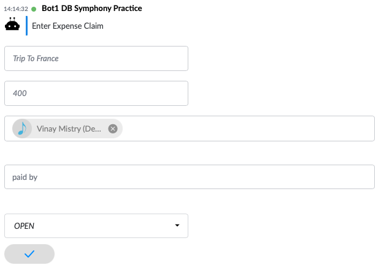
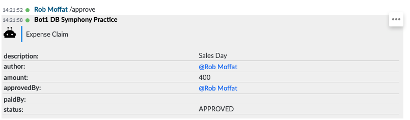
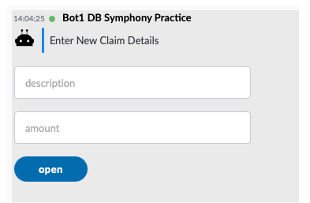
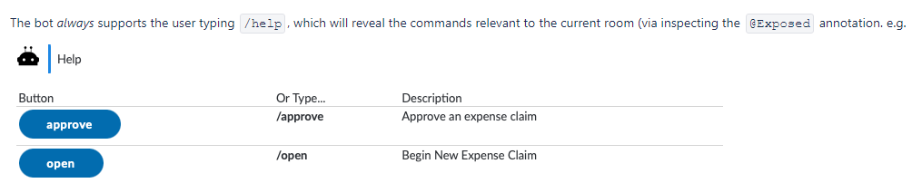
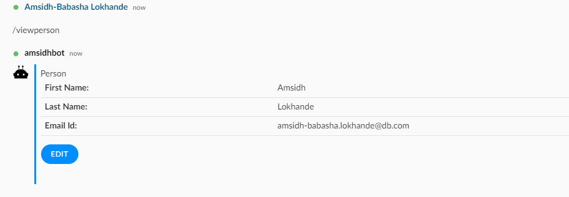
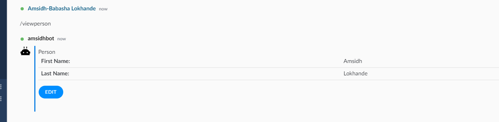

## Symphony Chat Workflow Annotations
This Document provides a detailed insight for the following Annotations: 

## @Work

The @Work annotation, which provides a human-readable name and instructions for people to perform a specific set of actions

Syntax :
   ```
   @Work(editable = false, instructions = "Sales Expense Claim Form", name = "Expense Claim")
   ```

Here editable says whether the bean is editable by Symphony user
Depending on the value of editable field, edit screen is available / hidden in UI
When editable = false , UI renders as : 

  

When editable is True , UI renders as : 

 
 
Click on the … to get the Edit button


## @Template

This Annotation conveys the chat-workflow-spring-boot-starter to use a template rather than build its 
Own


## @Exposed
This Annotation enables a method to be exposed to the user in a chat room

Syntax : 
```
@Exposed(description="Begin New Expense Claim")
  public static Claim open(StartClaim c) {
    Claim out = new Claim();
    out.description = c.description;
    out.amount = c.amount;
    return out;
  }
```
UI renders as : 

  

Explanation : 
When user types /open in the Room where this bot is added, Open() is called .
This Method requires an object of StartClaim class , Hence User is provided with a form to create object of StartClaim
The values passed to Description and amount are in turn passed to Claim class properties
2) @Exposed annotation can also be employed to verify the Workflow is applicable to specific room Only –

Syntax  :
```
@Exposed(description = "Approve an expense claim", rooms= {"Claim Approval Room"})
  public Claim approve() {
     ..
  }
```
If the room is not the one mentioned in rooms parameter , An exception will be thrown

3) @Exposed Annotation governs the /help
Typing in /help in any room fetches the help Items the bot can support in . Result may render buttons or suggestions depending on method definition  Ex :

    


## @Display Annotation:
   This annotation is used to customize the workflow attribute properties to display in symphony bot application. We can override the name, show/hide the attribute.
    
   This is an optional annotation. If you haven't used this annotation then workflow attribute will be displayed with default syntax of camel case having space between words.
    ```
    Syntax:
    @Display(name = "Amount", visible = true)
    Number amt;
    ```
    
   Properties of @Display annotation:
    Name -> This property is used to override the name of the attribute to display on symphony bot. 
    Visible -> This property is used to show or hide the workflow attribute to be displayed on symphony bot. Default value is true.

## Examples of Display Annotation:
   --	Without Display Annotation:
   
        ```
        @Work(name = "Person Form", editable = true, instructions = "Person Template")
        public class Person {
        
            private String firstName;
            private String lastName;
            private String emailId;
        ```    

    


   --	Display Annotation with name and visible parameters:

        ```
        @Work(editable = true, instructions = "Person Form", name = "Person")
        public class Person {
        
            @Display(name = "First Name", visible = true)
            private String first;
            @Display(name = "Last Name", visible = true)
            private String last;
            @Display(name = "Email ID", visible = false)
            private String email;
        ```

    


   --	Display annotation with visible true/false:

        ```
        @Work(editable = true, instructions = "Person Form", name = "Person")
        public class Person {
        
            @Display(name = "First Name", visible = true)   // visible with true which is default
            private String first;
            @Display(name = "LastName", visible = false)  //This will not be shown of bot as visible is false
            private String last;
            @Display(name = "Email ID")  //The attribute name is overridden 
            private String email;
        ```

    
   
