# Microsoft Teams Tutorial
{: no_toc }

<details open markdown="block">
  <summary>
    Table of contents
  </summary>
  {: .text-delta }
1. TOC
{:toc}
</details>

This is a short guide on how to get started with Microsoft Teams.  It is a bit of a minefield, but once you have your bot talking to the Spring Bot app, things are easy.  Hopefully this will give some clues as to how to get there.

## Create a Teams Developer Account

You can apply for a 90-day developer account that allows you to set up an instance of Microsoft Teams with up to 20 different users.   This allows you to work with colleagues to build and test a bot.

- You can apply for this [here](https://developer.microsoft.com/en-us/microsoft-365/dev-program)


- Create some user accounts and distribute them to your friends.


- With your own account, you should be able to log into Microsoft Teams with your `onmicrosoft.com` email:

  

- From here, you can explore the delights of Microsoft Teams, and talk to any friends you invited.

## Create a Bot

- Access the Teams Developer Portal [here](https://dev.teams.microsoft.com/home).

- Then go to `Tools -> Bot Management -> New Bot` and create your bot.

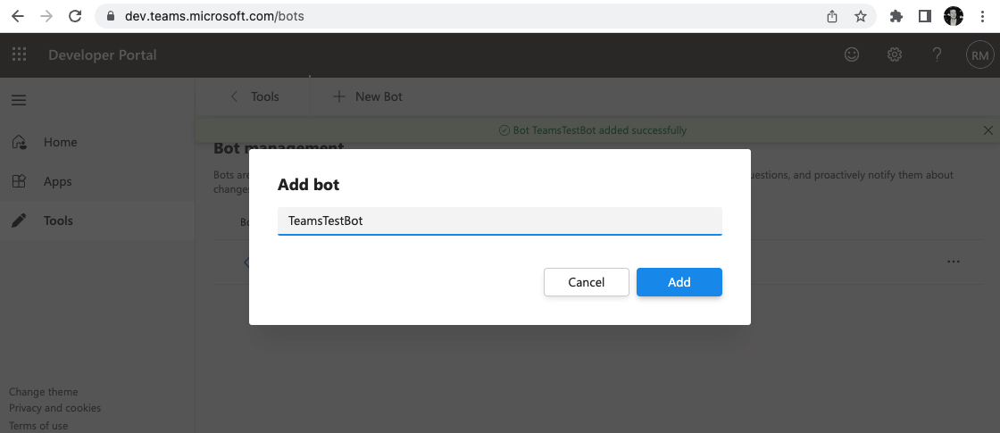

- Your bot will be given an **App ID** as shown below - you'll need this in your Spring Bot `application.yml` file later so keep a track of it.

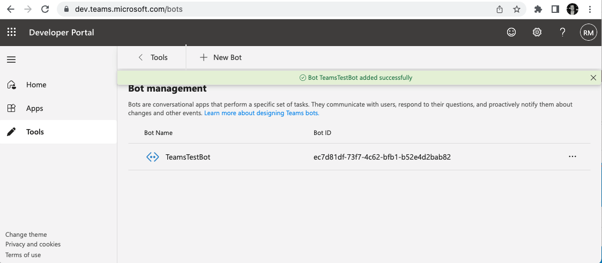

## `ngrok` Port Forwarding

Since your bot is running on `localhost`, Microsoft Teams can't access it.  However, we can use `ngrok` to tunnel onto the public internet, running in HTTPS with a proper certificate.  From there, we can get Microsoft Teams to talk to it.  

- Install `ngrok` from [here](https://ngrok.com/)

-  Start ngrok so that it forward traffic to `http` port `8080` on your localhost, like so:  

`ngrok http 8080`

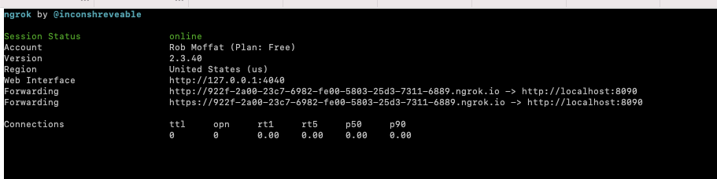

## Configuring the Bot

- Back in the developer portal, use the hostname provided by `ngrok` to specify the bot's endpoint.  Note this is the `ngrok` `HTTPS` address, but with `/api/messages` added to the end as a path.

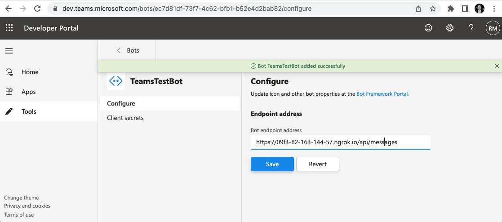

-  Next, the bot needs a secret.  Set one of these up and keep it for later to add to your `appplication.yml` file.

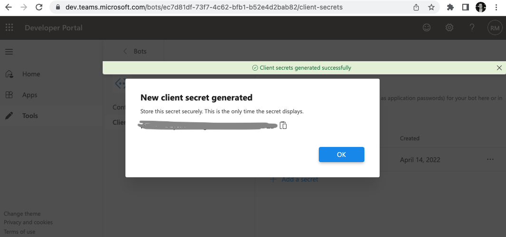


## Create an App Manifest on The Teams Developer Portal

We are going to create an `App`, which is something that is available in the Teams App Store, and can be installed into your Teams chats.   An `App` can contain a number of `bot`s.  Here, we'll just create one. 

- Click `New App` in the Teams Developer Portal:

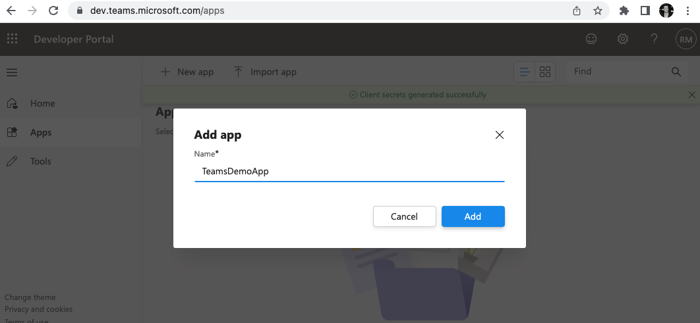

-  Enter Some Basic Details

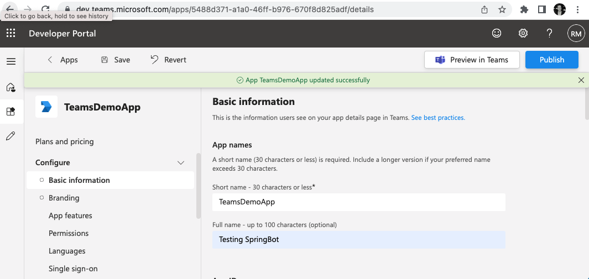
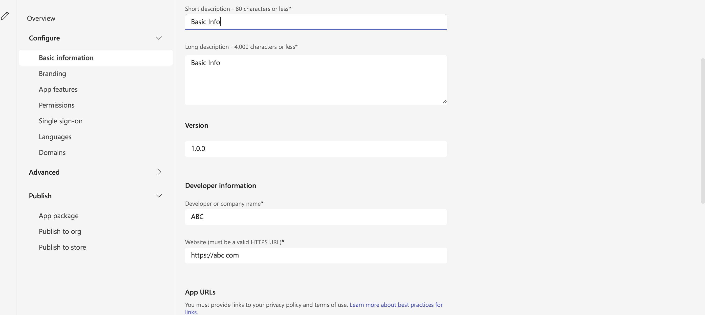
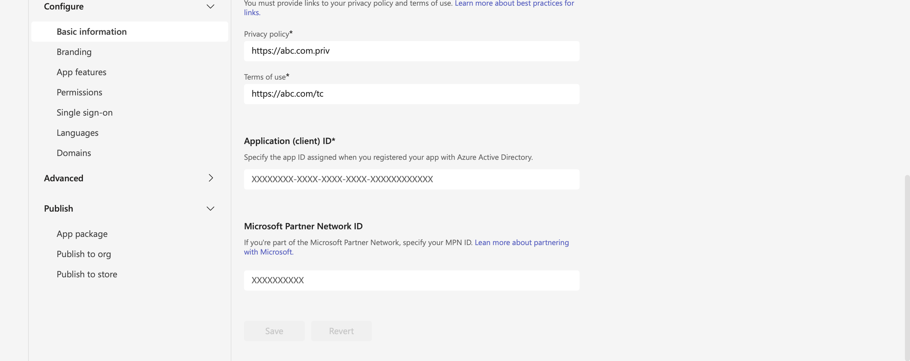

-  Associate The Bot With Your App

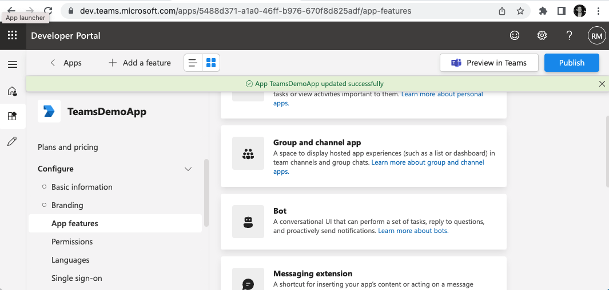

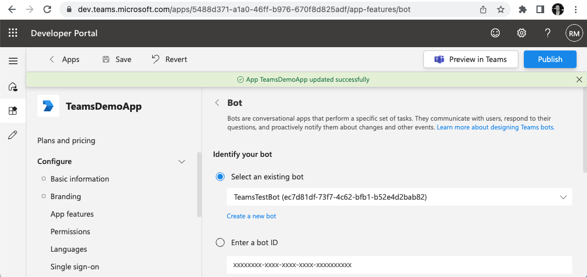

- Give The App Some permissions

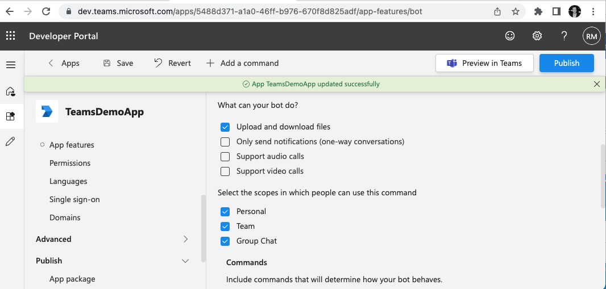

- Download the created App Manifest to your local machine: 

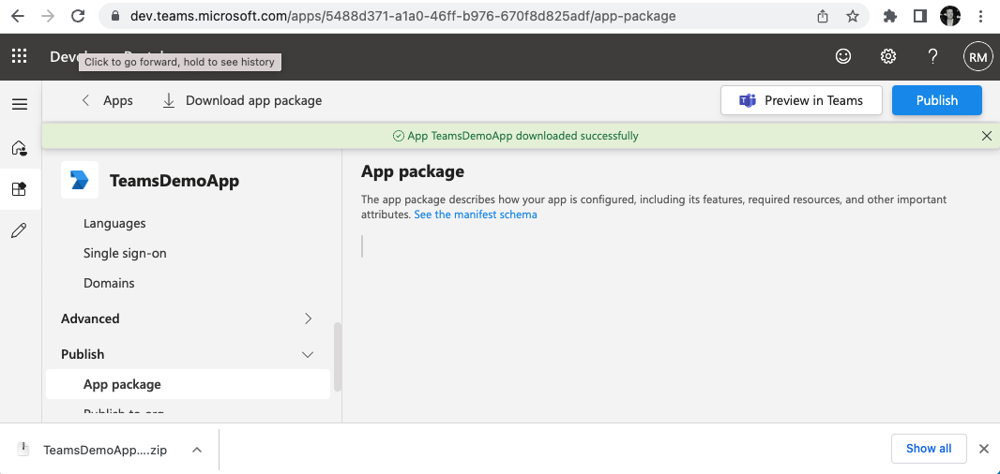

## Add The App To Your Teams Installation

Before you can see the App in the Teams App Store, it needs to be approved (published) by your Teams administrators.

The Admin Console has a "Manage Apps" section [here](https://admin.teams.microsoft.com/policies/manage-apps).

-  Upload Your App

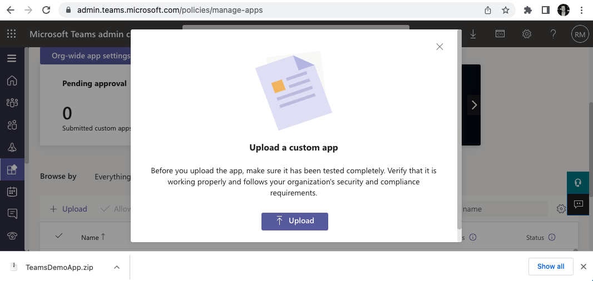

- Change Publishing Status to "Published"

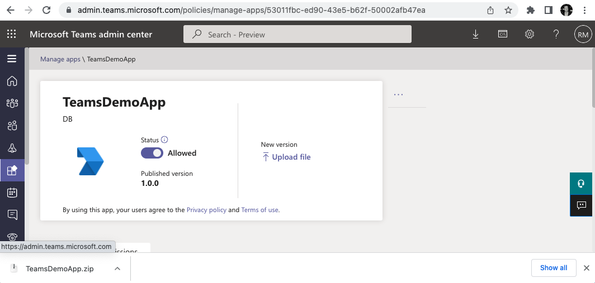

## Configure Your App On Teams

Now, we're going to create a chat on Teams and add the App to it.

- Restart Teams on your local PC.  This ensures the App-Store cache is wiped.  

- Create a new chat with some friends to try the bot out

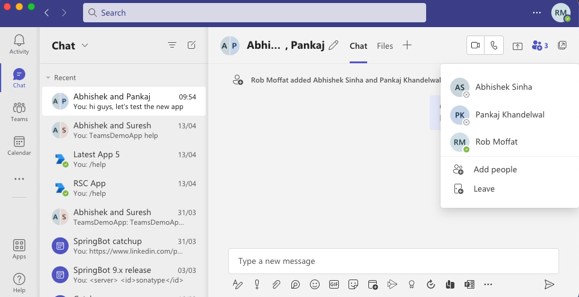

- Head over to the App Store and find your app:

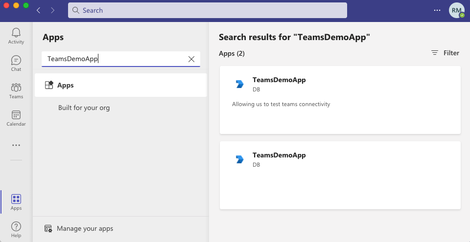

- Add the App to your new chat:

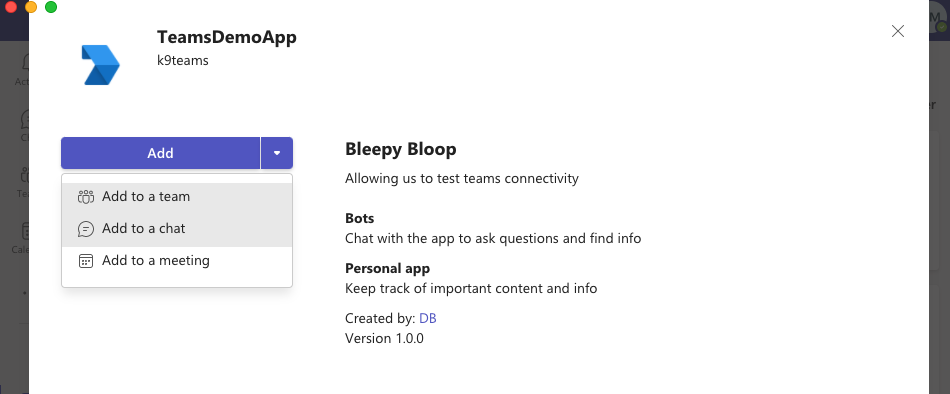

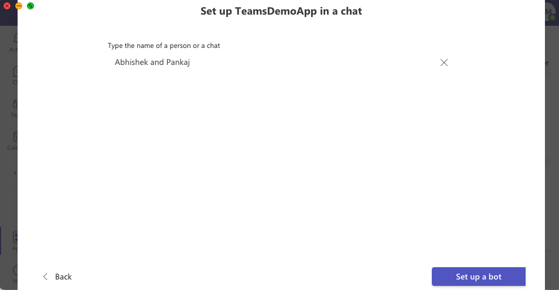


## Configuring `application.yml`

Your bot will need an `application.yml` file containing the details of your teams installation:

```
teams:
  app:
    tennantId: 
  bot:
    MicrosoftAppId: 
    MicrosoftAppPassword: 
  storage:
    type: blob
    connection-string: 
    
spring:
  profiles:
    active: teams  # put teams, symphony if you want both
```

Let's go through these settings in turn:

### `tennantId`

Here I am getting the Tennant ID from my Teams Instance.  This is from the [Azure Admin Portal](https://portal.azure.com/)


### `MicrosoftAppId`

This is the bot's AppId, which you can get from the Teams Developer Console:


### `MicrosoftAppPassword`

This is the bot client secret, that you generated earlier on.

### Storage Account

Unlike Symphony, Teams cannot store app-data inside chat messages, so we need to set up a separate Azure Blob storage.  
This allows the bot to keep track of the messages it has sent, and the conversations it is involved in.

- Head over to [https://portal.azure.com/](https://portal.azure.com/)

- Create The Blob Storage On This Screen

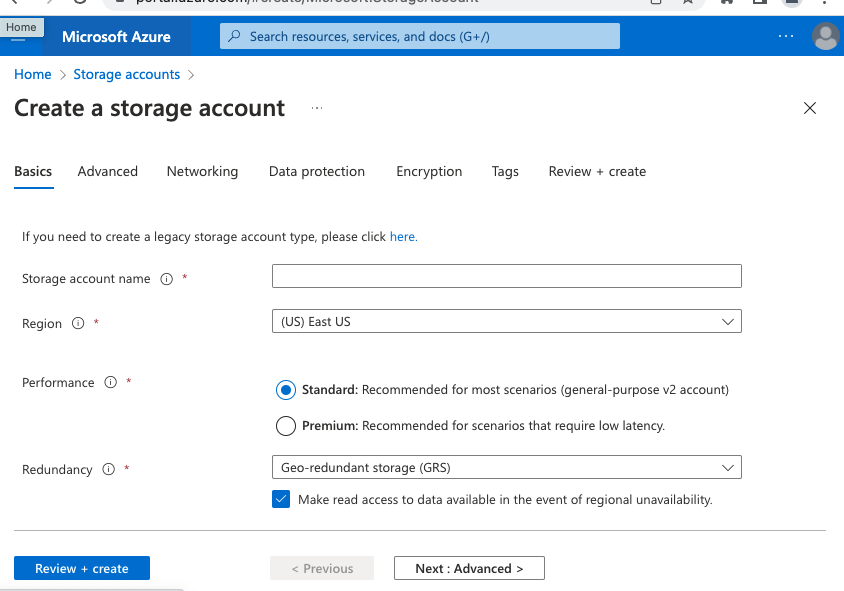

- You should end up with something like this:

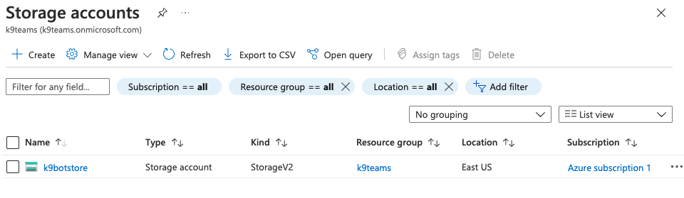

- Get the access key from this screen here and add it to `application.yml`:

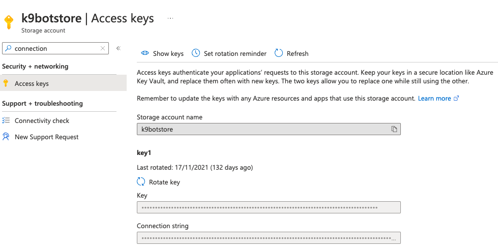

### Start the bot


## Talk With Your Bot

For example, try asking your bot for help:

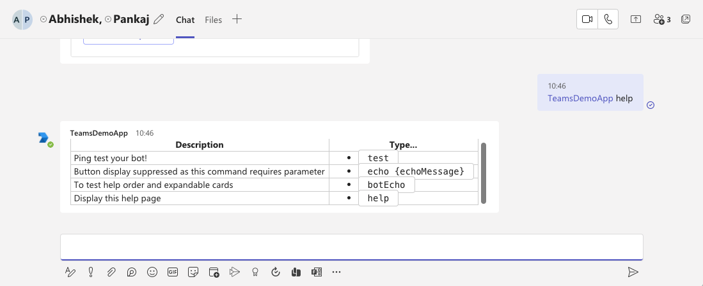

From then on, you can follow one of the other tutorials for building a bot with custom functionality.