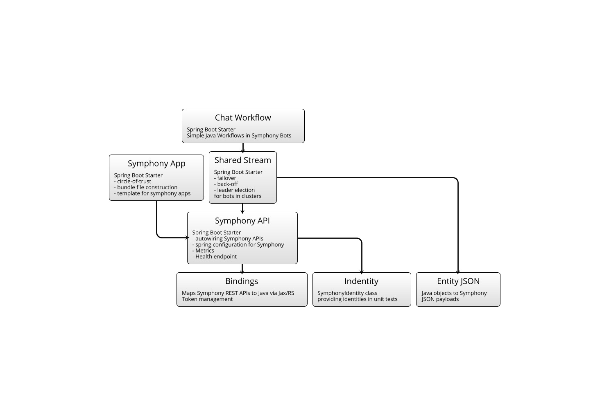

[](https://finosfoundation.atlassian.net/wiki/display/FINOS/Incubating)

[](https://codecov.io/gh/finos/symphony-java-toolkit)

[](https://search.maven.org/search?q=org.finos.symphony.toolkit)

## What This Is

This project is a set of libraries aimed at facilitating creating Bots and Apps for the [Symphony Chat Platform](https://symphony.com) using Java and [Spring Boot](https://spring.io/projects/spring-boot).

This project contains the following:

- Symphony Java Client Bindings
- Symphony Java Client Identity
- Symphony API Spring-Boot Starter
- Symphony App Spring-Boot Starter
- Symphony JSON Support
- Symphony FIX Support
- A Symphony Maven Build Notifier
- A TeamCity Build Notifier
- Symphony Shared Stream
- Chat Workflow
- KoreAI Connector
- Tutorials for getting started
- Demo bots and apps

Read further to see what each of these includes.

## Overview and Dependencies

Many of the components in this project rely on each other, as demonstrated in this dependency diagram.  This also gives and overviw of the purpose of each component.



## Symphony Java Client Bindings

This provides a JAX-RS standard, **Type-Safe** means of interacting with [Symphony](https://symphony.com) pods via REST apis.

`bindings` is a set of swagger-generated domain objects and interfaces that provide a Java API for interacting with Symphony's REST endpoints. 

- [Symphony REST Endpoint Documentation](https://rest-api.symphony.com/reference)
- [Symphony REST Endpoint Swagger Definitions](https://github.com/symphonyoss/symphony-api-spec)

This is used in preference to Symphony's own API as the configuration can be left to spring boot, and you can use Spring's starters for JAX-RS to build your application.

[View The README](bindings/README.md)

## Symphony Java Client Identity

`symphony-java-client-identity` provides a single abstraction of `SymphonyIdentity`, which encapsulates the data needed to authenticate with a symphony server.  That is:
 
 - Private Key
 - Certificates
 - Common Name
 - Email Address

This is a highly convenient abstraction which works with Spring Boot's use of [Jackson](https://github.com/FasterXML/jackson) and [YAML](https://yaml.org) to describe Bot and App identities in Java.

[View The README](identity/README.md)

## Symphony API Spring Boot Starter

Provides Spring-Based configuration and auto-wiring for Symphony APIs.  This is perfect if you are building a Symphony Bot using Spring Boot.

 - [View the README](symphony-api-spring-boot-starter/README.md)
 - [Read the Bot-Building Tutorial](tutorials/Spring-Boot-Bot.md)
 - [View Demo Bot Code](https://github.com/finos/symphony-java-toolkit/tree/master/demos/demo-bot)

## Symphony App Spring Boot Starter

If you are building a Symphony App, there are multiple concerns around app security, networking, describing your application and handling user authentication.  

This provides you with an out-of-the-box way to get started and build an app with all of these concerns taken care of.

 - [View the README](symphony-app-spring-boot-starter/README.md)
 - [Read the App-Building Tutorial](tutorials/Spring-Boot-App.md)
 - [View Demo App Code](https://github.com/finos/symphony-java-toolkit/tree/master/demos/demo-app)

## Entity JSON - Symphony JSON Support

This is a utility that helps you serialize/deserialize JSON in a format suitable for the JSON data payload of a Symphony Message, using Jackson.

 - [View the README](entity-json/README.md)
 - [Read the Tutorial](tutorials/Entity-JSON.md)
 
## QuickFIX Support

This is a utility that helps you serialize/deserialize QuickFIX messages into JSON Format, as described [here](https://github.com/FIXTradingCommunity/fix-json-encoding-spec/blob/master/Encoding_FIX_using_JSON-User_Guide.md).

Although this is not reliant on Symphony code, it is adjacent tech and so might be useful for sending FIX payloads within Symphony.

 - [View the README](quickfix-json/README.md)
 
## Maven Build Reporter

Provides a maven extension that allows you to report build results into a Symphony chat room.  

 - [View the README](symphony-maven-build-reporter/README.md)
 
## TeamCity Build Notifier

Allows you to report your TeamCity builds into Symphony chat rooms, using a bot.

 - [View the README](teamcity-symphony-integration/README.md)
 
## Symphony Shared Stream

The purpose of this module is to provide a drop-in stream consumer for Symphony that allows a cluster of bot replicas to coordinate work.  That is, prevent the problem of two or more bots simultaneously consuming and processing the same Symphony message.

 - [View the README](shared-stream-spring-boot-starter/README.md)
 
## Chat Workflow

This module provides a one-stop-shop for constructing work-flows in Java.  It is intended that beyond _configuration_ the developer will not have to understand _any_ Symphony APIs to build work-flows and have them run in Symphony.

 - [View the README](chat-workflow-spring-boot-starter/README.md)
 - [View the Tutorial](tutorials/Chat-Workflow.md) 
 - [Demo Poll Bot](demos/poll-bot/README.md)
 - [Demo To-Do List Bot](demos/todo-bot/README.md)
 - [Demo Claim Bot](demos/claim-bot/README.md)
 - [RSS News Bot](demos/rss-bot/README.md)
 
## Kore-AI Bridge

This is a Spring Boot App that acts as a middleman between a Symphony bot and a KoreAI bot, allowing you to expose your KoreAI bot as a bot on Symphony.  [Kore.AI](https://kore.ai/) is a low code/no code environment for building chat bots.

 - [View the README](koreai/README.md)

## License

This project is licensed under the [Apache 2.0 License](LICENSE).

## Running The Demo Bots


## Releasing This Project (For Maintainers)

In order to do a release:

1.  Changes.md

- Update this file to include details of the release.

2. On Releaser's machine:

```
mvn clean test -P symphony-ci
mvn versions:set -DnewVersion=<our breaking change no>.<symphony-api-version>.<our-release-no> -DartifactId=\*  -DgroupId=\*
mvn -DskipTests -pl '!demos/demo-bot,!demos/demo-app,!demos/claim-bot,!demos/poll-bot,!demos/todo-bot,!demos/rss-bot' clean test source:jar javadoc:javadoc deploy -P symphony-release
mvn versions:set -DnewVersion=<our breaking change no>.<symphony-api-version>.<our-release-no+1>-SNAPSHOT -DartifactId=\*  -DgroupId=\*
# then push to git
```

3.  On `oss.sonatype.org`

- Close the Staging Repository
- Release it.

4.  Perform release on github with same number
 
