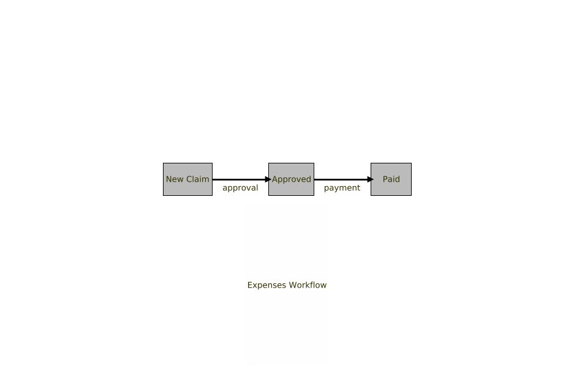
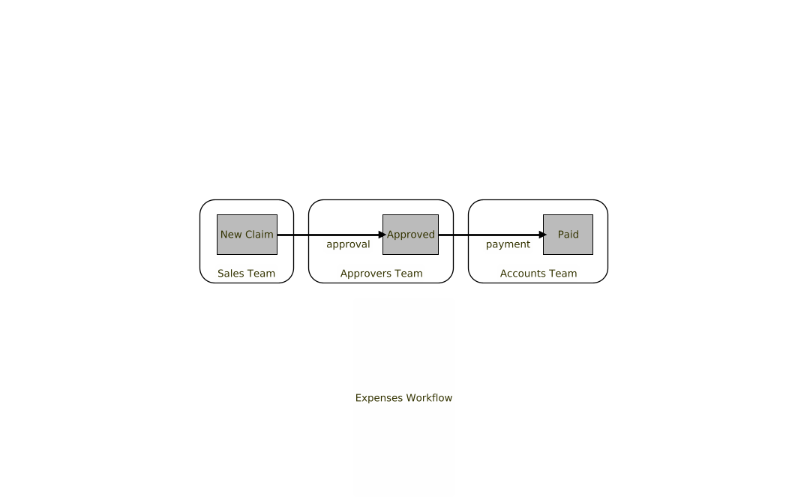
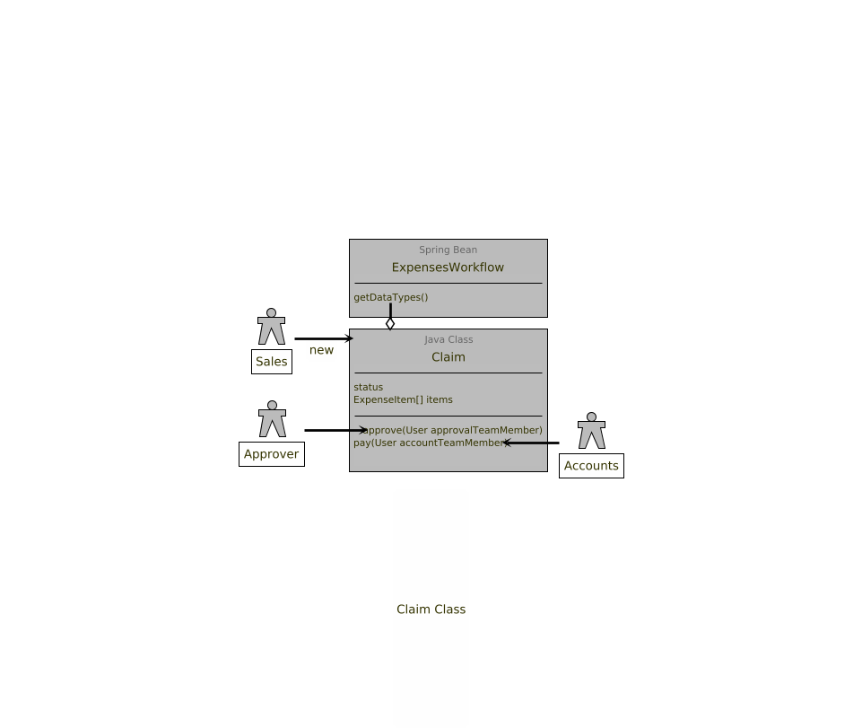

[](https://search.maven.org/search?q=com.github.deutschebank.symphony)

# Spring Boot Starter for Chat Workflow

This module provides a one-stop-shop for constructing work-flows in Java.  It is intended that beyond _configuration_ (see below), the developer will not have to understand _any_ Symphony APIs to build initial proof-of-concept work-flows and have them run in Symphony.

## Installation

1.  You will need a bean exposed in Spring implementing the interface `com.github.deutschebank.symphony.workflow.Workflow`.

2.  You will need to configure the `application.yml` for a bot as described in [Spring Boot Starter for Symphony Api](../symphony-api-spring-boot-starter/README.md).

3.  Add the following dependency in your application:

```xml
<dependency>
  <groupId>com.github.deutschebank.symphony</groupId>
  <artifactId>chat-workflow</artifactId>
  <version>--see above--</version>
</dependency>
```

NB:  Chat workflow will bring in the other Spring Boot Starters transitively, so you don't need to specify those.

4.  Add the dependency for a JAX-RS implementation, as described [here](../symphony-api-spring-boot-starter/README.md).

## Overview

### What Exactly is a Work-Flow?

A _workflow_ here is a sequence of interactions carried out by a group of users, coordinated with a bot.  For example, an expenses workflow might look like this:



Note - different people are responsible for different _actions_ in the workflow, that move the state of the workflow on. 

- User A from the Sales Team _raises_ a claim containing some line-item expenses.
- The claim passes to User B to approve.
- User C is required to process the claim and transfer A some money.  

These users might belong to different _teams_, as shown below:



### How Can Symphony Help?

Symphony is perfect for workflows like this:

1.  Symphony supports messages containing _data_, via the use of JSON, and also supports form-filling via Symphony Elements.  That means, you can keep track of the status of workflow objects within Symphony.  In the example above, the _state_ of the expense claim can be held in a Symphony message as JSON.

2.  Symphony also supports the ideas of teams via private rooms.  That is, there could be rooms called "Sales Team Room", "Approvers Team Room" and "Accounts Team Room".  This provides a natural separation of responsibilities:  some actions should only be allowed by the participants of some rooms.

3.  Bots allow us to provide the interface between a workflow (expressed as java code) on the one hand, and messages in Symphony on the other.

### What Would I Need To Do?

In order to build a workflow like the one above, you simply need to create a Java class to encapsulate all of this data, and then use the appropriate annotations to say which methods can be used in which rooms.



The UML diagram above demonstrates this, and here is some skeleton Java code which implements this:

```java
@Work(editable = false, instructions = "Expenses Claim")
public class Claim {
  
  enum Status { OPEN, APPROVED, PAID };
  
  String description;
  
  Author author;
  
  float amount;
  
  User approvedBy;
  
  User paidBy;
  
  Status status;

  // getters & setters omitted for brevity. 

}
```


