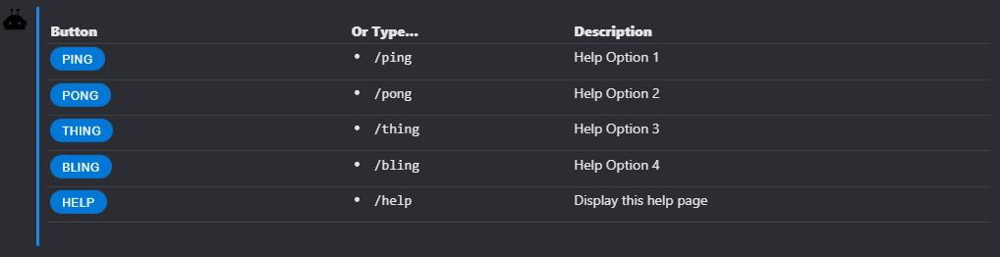
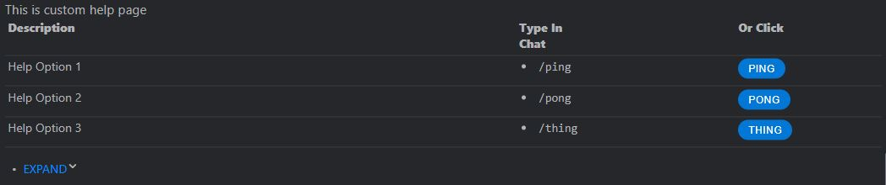
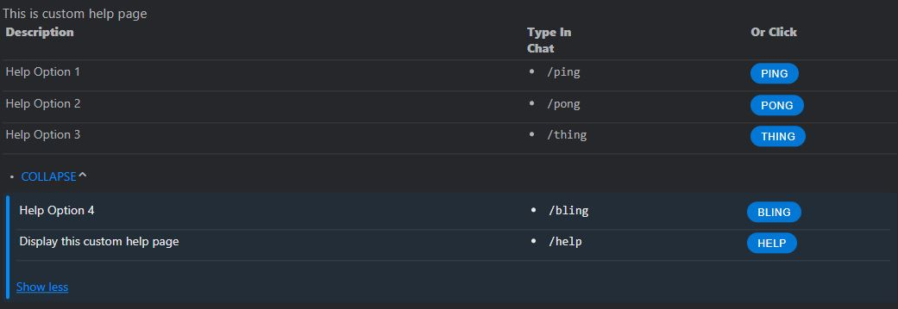
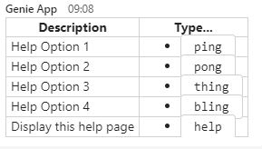
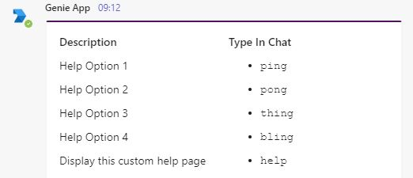
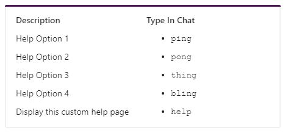

# Demo Bot with Custom Help page

This bot provides an example of how you can override "baked-in" beans within Spring.  In this case, we are overriding the `HelpController` bean with our own, custom `CustomHelpController`.  

This is applicable to all the beans in Spring Bot.

You will need to provide settings for the `application.yml` file according to your own environment.

----
For instance, you can change below `default` Symphony help page -

With this custom Expandable Card help page -

Help page expanded

----
And for MS Teams, you can change for Channel & Chat from -

 

To consistent AdaptiveCard across Teams Channel & Chat -

 