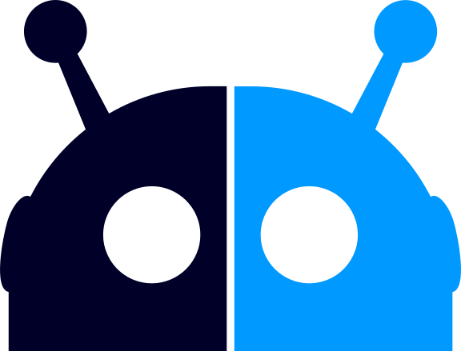

<section class="front-page-top">
  <div class="logo-surround">
    <div class="logo-image">
      
    </div>
    <div class="logo-title"><span class="logo-spring">SPRING</span><span class="logo-bot"> BOT</span></div>
  </div>
</section>

<section class="front-page-alt"><div class="inner flex"><aside markdown="1">

  “Like [Spring Web MVC](https://spring.io/guides/gs/serving-web-content/)...
     but for building chat-bots”
  
</aside><div markdown="1">
  This project is for:
  
   - building chat-bots in Java/Kotlin using Spring / Spring Boot
   - using a familiar, Spring-annotation-driven way to configure bots.
   - having access to the Java & Spring ecosystems for complex bot use-cases 
   
  Although there are many low-code and no-code ways to put a chat-bot together now, for advanced use-cases and situations where you want to integrate with existing systems, Java will be the way to go.   
  
</div></div></section>

<section class="front-page"><div class="inner">
<h1>One Quick Example</h1>
<div class="grid"><div class="item" markdown="1">

Here is an excerpt from the [To-Do Tutorial](getting-started.md).  

Let's say I have a simple POJO called `ToDoItem` (containing fields like `Description`, `Creator` etc.) and a further POJO called `ToDoList` which looks like this.

</div>

<div class="item"  markdown="1">

```java
@Work
public class ToDoList {

  private List<ToDoItem> items = 
       new ArrayList<ToDoItem>();

  // setters/getters omitted for brevity
  
}
```

</div><div class="item"  markdown="1">

We can create a Spring Controller like so:

</div><div class="item"  markdown="1">

```java
@Controller
public class ToDoController {

  @ChatRequest(value="new", 
     description = "Create new item list")
  public ToDoList init() {
    return new ToDoList();
  }

```

</div><div class="item"  markdown="1">


</div><div class="item"  markdown="1">

This creates a new command for the bot.  When I type `/help`, the bot responds with...

</div><div class="item"  markdown="1">


</div><div class="item"  markdown="1">

When I type `/new` the bot responds with an empty To-Do list like so.

</div><div class="item"  markdown="1">

I can put an add button on the To-Do list like this:

</div><div class="item"  markdown="1">

```java
@Controller
public class ToDoController {
  
 // Other methods
  
 @ChatButton(value = ToDoList.class, 
   buttonText = "Add")
 @ChatResponseBody(
   workMode = WorkMode.EDIT)
 public NewItemDetails add(User author) {
  NewItemDetails out = 
    new NewItemDetails();
  out.assignTo = author;     
  return out;
 }
}
```

</div><div class="item"  markdown="1">


</div><div class="item"  markdown="1">

This button will then appear on my To-Do List.

</div><div class="item"  markdown="1">

... and so on. [Tutorial continues here.](getting-started.md)

</div></div>

</div></section>

<section class="front-page-alt"><div class="inner flex"><aside markdown="1">

“Spring Bot handles [MVC](https://en.wikipedia.org/wiki/Model–view–controller) for your bot”

</aside><div markdown="1">

## Model

- Build stateless bots:  store all working state as data within the chat platform. 
- Create POJOs for your data model, persisting data into chat rooms and retrieving it using the [`History` API](reference.md#history).
- Spring Bot will handles serialization / deserialization via [Jackson]().

## View

 - Spring Bot can auto-generate default views of your models. 
 - It provides functionality for using alternate views, and customizing views for each platform.
 
## Controller

 - Mapping of `methods()` on your `@Controllers` to messages sent to the bot.
 - Resolving method parameters like `User`, `Word`, `HashTag`...
 
</div></div></section>

<section class="front-page"><div class="inner" markdown="1">


# Platform Bindings

Spring Bot is designed to be an _abstraction layer_ on top of other Java bot libraries.  i.e it handles the concerns above, and leaves the connectivity and API logic to lower-level libraries.  

This means that you can build bots in Spring Bot that will work concurrently on different chat-platforms.

Currently we have just have bindings for [Symphony](symphony.md) with MS Teams coming next.

</div></section>


<section class="front-page-alt"><div class="inner flex"><aside markdown="1">

Read the [Getting Started](getting-started) tutorial to see how...

</aside><div markdown="1">

## Tools

To see how this toolkit works in action, check out some source code here:

### [Reminder Bot](https://github.com/finos/symphony-java-toolkit/tree/master/tools/reminder-bot)

Creates reminders in chat rooms when you start talking about time.  Uses Stanford NLP Time package.

### [RSS (News) Bot](https://github.com/finos/symphony-java-toolkit/tree/master/tools/rss-bot)

Allows you to configure news feeds into chat rooms.

### [Poll Bot](https://github.com/finos/symphony-java-toolkit/tree/master/tools/poll-bot)

Allows you to poll the members of a room, providing a question and a list of answers to vote on.

</div></div></section>

<section class="footer"><div class="inner footer">
  <a href="https://www.finos.org">
  </a>
</div></section>

