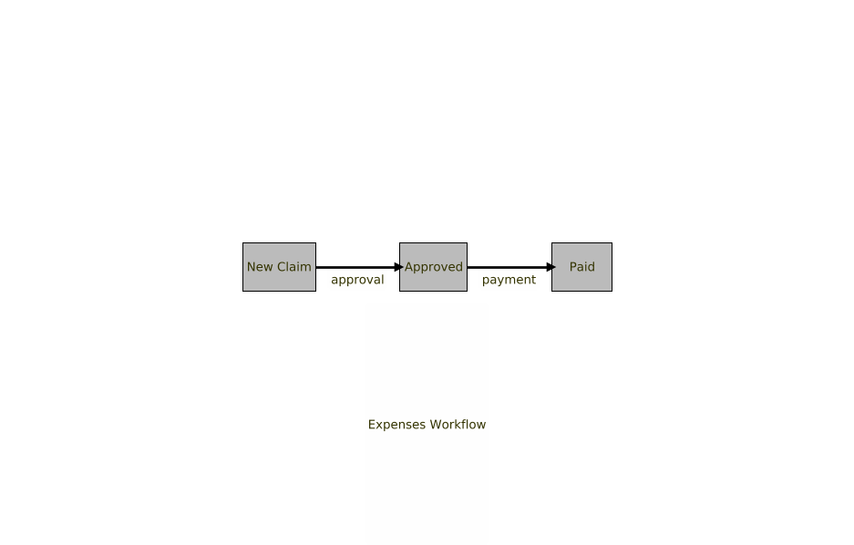
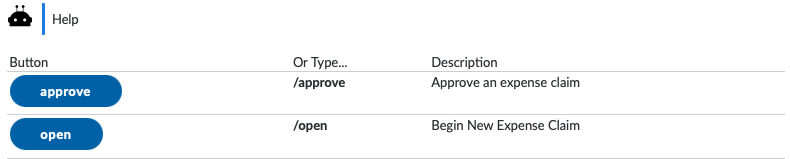

[](https://search.maven.org/search?q=org.finos.symphony.toolkit)

# Spring Boot Starter for Chat Workflow

This module provides a one-stop-shop for constructing workflows in Java.  It is intended that beyond _configuration_ (see below), the developer will not have to understand _any_ Symphony APIs to build initial proof-of-concept work-flows and have them run in Symphony.

## Example Use-Cases

- Below, we concentrate on building an _Expense Claim_ workflow.
- In the [Tutorial](../../tutorials/Chat-Workflow.md), we show how to build a _To Do List_.
- In the [Demo ToDo Bot](../../demos/todo-bot/README.md), we have the code for the above
- In the [Demo Claim Bot](../../demos/claim-bot/README.md), the claims bot, described below.
- in the [Poll Bot](../../tools/poll-bot/README.md), a working poll bot that can be deployed on Symphony.

Each use-case is a couple of classes in size, and relies on zero understanding of the Symphony APIs.

## Overview

### What Exactly is a Workflow?

A _workflow_ here is a sequence of interactions carried out by a group of users, coordinated with a bot.  For example, an expenses workflow might look like this:



Note - different people are responsible for different _actions_ in the workflow, that move the state of the workflow on. 

- User A from the Sales Team _raises_ a claim containing some line-item expenses.
- The claim passes to User B to approve.
- User C is required to process the claim and transfer A some money.  

These users might belong to different _teams_, as shown below:


### How Can Symphony Help?

Symphony is perfect for workflows like this:

1.  Symphony supports messages containing _data_, via the use of JSON, and also supports form-filling via Symphony Elements.  That means, you can keep track of the status of workflow objects within Symphony.  In the example above, the _state_ of the expense claim can be held in a Symphony message as JSON.

2.  Symphony also supports the concept of teams via private rooms.  That is, there could be rooms called "Sales Team Room", "Approvers Team Room" and "Accounts Team Room".  This provides a natural separation of responsibilities:  some actions should only be allowed by the participants of some rooms.

3.  Bots allow us to provide the interface between a workflow (expressed as java code) on the one hand, and messages in Symphony on the other.

## Installation


1.  Add the following dependency to your Spring Boot application:

```xml
<dependency>
  <groupId>org.finos.symphony.toolkit</groupId>
  <artifactId>chat-workflow-spring-boot-starter</artifactId>
  <version>--see above--</version>
</dependency>
```

2.  You will need a bean exposed in Spring implementing the interface `org.finos.symphony.toolkit.workflow.Workflow`. (See below).

3.  You will need to configure the `application.yml` for a bot as described in [Spring Boot Starter for Symphony Api](../symphony-api-spring-boot-starter/README.md).  NB:  Chat workflow will bring in the other Symphony Spring Boot Starters transitively, so you don't need to specify those.

4.  Add the dependency for a JAX-RS implementation, as described [here](../symphony-api-spring-boot-starter/README.md).

## Implementing A Workflow

In order to build a workflow like the one above, you simply need to create a Java class to encapsulate all of this data, and then use the appropriate annotations to say which methods can be used in which rooms.


There are three steps to building a workflow using `chat-workflow-spring-boot-starter` in Symphony:

1. **Add Classes:** Java Beans will represent _structured messages_ in Symphony.  That is, it'll have JSON data (for the bot to understand) and MessageML (for presentation to users).
2. **Add Properties:** Properties of the Java bean will be rendered as _elements_ in Symphony, so that users can set their values.
3. **Add Methods:** Methods are commands that users can invoke, either by pressing a button (again, using Symphony _elements_) or typing a message (e.g. /command).
 
The [Tutorial](../../tutorials/Chat-Workflow.md) shows how to get Symphony to host to-do lists in chat rooms, and is a good place to start.  The rest of this README will focus on breaking down the steps described above, detailing all the options.

### 1.  Add Classes

`chat-workflow-spring-boot-starter` requires a Spring bean of type `org.finos.symphony.toolkit.workflow.Workflow` to be present.  The easiest way to provide one of these is to instantiate `ClassBasedWorkflow` like so:

```java

@Configuration (1)
public class WorkflowConfig {


  @Bean
  public Workflow appWorkflow() {
    ClassBasedWorkflow wf = new ClassBasedWorfklow(WorkflowConfig.class.getCanonicalName()); (2)
    wf.addClass(Claim.class); (3)
  }
  
}
```

Notes:

1.  This is a Spring `@Configuration` class, so contains programmatically-defined `@Bean`s.  
2.  We create the `ClassBasedWorkflow` bean. The parameter is a namespace - all messages related to this workflow will have a `hashtag` containing this namespace to identify them to the bot.
3.  We are adding the `Claim` class to the workflow, which is defined below:

```java
@Work(editable = false, instructions = "Sales Expense Claim Form", name = "Expense Claim") (1)
public class Claim {
  
  enum Status { OPEN, APPROVED, PAID };(2)
  
  String description;
  
  User author = Author.CURRENT_AUTHOR.get();  (3)
  
  Float amount;
  
  User approvedBy;  (4)
  
  User paidBy;      (4)
  
  // getters & setters omitted for brevity. (5)

  Status status = Status.OPEN;  (5)

 
}
```

Notes:

1. The `@Work` annotation describes the workflow object to our `ClassBasedWorkflow` implementation.  As you can see, here we can say whether the bean is editable by the users in Symphony (if it is, we render the properties as elements).  You can give a human-readable name and description for the java class here.
2. (&6) Here, we are defining the different states a workflow can be in.  
3. Assign the creator as the person interacting with the bot in this request.
4. These fields will track approvals.
5. You _must_ provide getters and setters for any properties you want Symphony to store/expose.  

### 2.  Add Properties

As you can see in the example above, we have various different properties defined, which will be rendered on the screen in one of two ways:


Either as _editable properties_ as above.


Or as _display properties_ as above.  If the `@Work(editable=true)` annotation is set, we get an `Edit` button on the display screen.

#### Supported Property Types

Out-of-the-box support exists for:

- `Collection`s (e.g. `List`s) of other objects in the workflow
- `String`s
- `Number`s
- `Instant`s
- Other objects in the workflow as nested properties.
- `Room`:   the name of a room
- `Tag`s, including `HashTag`, `CashTag` and `ID` ( a hashtag build on a UUID, used for identifying objects uniquely in the workflow).
- `User`: the name of a user, rendered as an @-mention for viewing, or a user-picker when editing
- `Author`: the person talking to the bot

#### Extending Support To New Types

If you want to customize the way in which the Freemarker templates are created (for example, adding support for a new Java Class) you can do this by implementing `org.finos.symphony.toolkit.workflow.sources.symphony.handlers.freemarker.TypeConverter`. There are plenty of examples of these in the source code.  `AbstractSimpleTypeConverter` is a good thing to extend for this.

#### Limitations

At the moment, the forms are displayed by walking the class structure and inspecting the declared types (not instance types).  For that reason, polymorphism won't work: only the fields in declared types will be shown.

#### Overriding The Default Displays

`chat-workflow-spring-boot-starter` does a serviceable job of creating a form for the user to fill in, or a display of the properties in a workflow object.  However, it won't win any design awards as-is.   Luckily, Symphony supports the use of Apache Freemarker templates for styling your workflow objects.  

The [Poll Bot](../../tools/poll-bot/README.md) example uses this a lot.  Have a look at the `Poll` class below:


```
@Work(name = "Poll", instructions = "Please participate in our poll", editable = false)
@Template(view = "classpath:/template/poll.ftl")
public class Poll {

   ...

```

Here we use the `@Template` annotation to tell `chat-workflow-spring-boot-starter` to use a template rather than build it's own.  To get you started, the forms that `chat-workflow-spring-boot-starter` produces for your classes are shown in the log file, along with the JSON that powers them, so you can easily [edit them in Symphony's PresentationML Tool](https://renderer-tool.app.symphony.com/).


 
#### Validation

You can add validation annotations a la [JSR-380](https://beanvalidation.org/2.0-jsr380/) to your properties.  For example:

```
@Work(name = "New Claim Details")
public class StartClaim {

  String description;
  
  @Min(0)   # Part of JRS-380 Bean Validation, must be > 0
  Number amount;

```

If the user enters an incorrect value, they will get an error, like so:


This is particularly useful for things like email addresses, where you might want to add `@Email` to ensure the user enters a correctly formatted email address. 
 
### 3. Add Methods

In order to move from one state in the workflow to another, we need _methods_ on our beans.  `chat-workflow-spring-boot-starter` supports both static and instance methods. 

In order for a method to be available to users in Symphony, you need to tag it with the `@Exposed` annotation.  

#### Static Example

These are useful for when there is no context to an operation. e.g. creating a new expense claim.  The method looks like this:

```java

  @Exposed(description="Begin New Expense Claim")
  public static Claim open(StartClaim c) {
    Claim out = new Claim();
    out.description = c.description;
    out.amount = c.amount;
    return out;
  }
```

Here, we are starting a new expense claim, and the interaction will look like this:


As you can see, the user types `/open` to call the `open()` method above.  The method takes a parameter of a `StartClaim` object, so the bot displays a form, allowing a `StartClaim` object to be created.

This then allows the `open()` method to start properly:  a new `Claim` object is created, filled and returned to the user.

#### Instance Method Example

The `Claim` object has a method `approve()` which looks like this:

```java
  @Exposed(description = "Approve an expense claim")
  public Claim approve() { (2)
    if (this.status == Status.OPEN) {
      this.approvedBy = Author.CURRENT_AUTHOR.get();
      this.status = Status.APPROVED;
    }
    return this;
  }
```

You can invoke the method by entering `/approve`:


`this` is given the value of the _last `Claim` object in the chat_.  As you can see, I am able to approve my own expense claim!  We'll address this issue later.  

#### Allowed Parameters

`ClassBasedWorkflow` is quite intelligent with respect to filling the parameters of the methods for you.  As you can see in the static-call example above, a `StartClaim` object is provided in order to satisfy the methods' requirements.  Here are other parameters you can add:

##### Subclasses of `Content`

e.g. `Message`, `Paragraph`, `PastedTable`, `Tag`, `User`, `Word`, `CashTag`, `HashTag`

Let's say you want your bot to have a command like:  `/assign #TASK820 @RobMoffat`.  You could have a method with a signature like this:

```java
@Exposed(description="Assign task to user")
public Task assign(Tag task, User u) {
  ...
}
```

The first `Tag` parameter would be assigned the first hashtag the user types, and so on.  

If you want something more generic (assigning multiple tasks, say) you could try:

```java
@Exposed(description="Assign all tasks to user")
public Task assign(Message m) {
   List<Tag> allTags = m.only(Tag.class);
   User firstUser = m.getNth(User.class, 0);
   ...  
}
```

##### Workflow Objects

There are various other objects you can request as parameters for a method:


|Class                   |Use                         |
|------------------------|----------------------------|
|`Workflow`               |The workflow object that the bot is running.  |
|`History`                |A class which allows you to interrogate the history of the chat room(s) with methods like `getLastFromHistory()`|
|`Rooms`               |A class which allows you to get or create new rooms for the bot to work in, with methods like `getAllRooms()` and `ensureRoom()`|
|Spring Beans            |Any `@autowire`-able bean from Spring can be a parameter|
|Any Workflow class      |Will add the last instance of the class from the history of the chat
|`Author`              |The author of the message that the bot is currently responding to.

#### Allowed Return Types

Most of the time, you'll probably just want to return something into the chat which originated the method-call.  To do this, simply return an object like in the examples above.  

Alternatively, you can return an instance of ` org.finos.symphony.toolkit.workflow.response.Response`, or even a whole list of those.  An example of where this might be useful is the poll bot in the demo workflow.  After a poll is created, it sends a message to every person in the room.  To do this, it's signature is:

```java

  @Exposed
  public static List<FormResponse> poll(ChoiceForm cf, Room r, Workflow wf) {
     ...
     
  }
```

`FormResponse` is a subclass of `Response`, allowing you to send a form.  Here are the possible `Response` types:


|Class                |Purpose                   |
|---------------------|--------------------------|
|`AttachmentResponse`   |Allows you to send the user an attachment (an image or something)|
|`FormResponse`         |Send the user a bean, which is turned into a form to fill in|
|`MessageResponse`      |Send a `MessageML` message to the user|
|`ErrorResponse`       |Sends a formatted error message (mainly used internally)   |    
  
#### Limiting Methods To Certain Users

The whole point of a workflow is that different users are allowed to perform different tasks.  In order to enforce this kind of segregation of responsibilities, we need to use different _rooms_.  If you are a member of a room, you are entitled to view the workflows in the room, and interact with them.  By managing the membership of key rooms, you can make sure that only the right users can execute the right methods.

```java
  @Exposed(description = "Approve an expense claim", rooms= {"Claim Approval Room"})
  public Claim approve() {
     ..
  }
```

In the example above, we ensure that the room is the "Claim Approval Room".  Alternatively, we can examine the room programmatically, like this:

```java
  @Exposed(description = "Approve an expense claim")
  public Claim approve(Room r) {
     if (r.getRoomName().equals("Claim Approval Room")) {
       ..
     } else {
       throw new RuntimeException("Some error");
     }
  }
```


## Asking For Help

The bot _always_ supports the user typing `/help`, which will reveal the commands relevant to the current room (via inspecting the `@Exposed` annotation.  e.g.



Depending on the arguments of the command, they may be shows as buttons, or suggestions of what to type.

