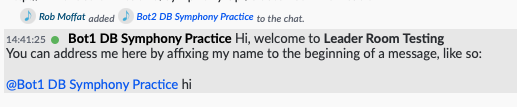

[](https://search.maven.org/search?q=org.finos.symphony.toolkit)[](https://javadoc.io/doc/org.finos.symphony.toolkit/symphony-shared-stream/latest/index.html)

# Symphony Shared Stream

The purpose of this module is to provide a drop-in stream consumer for Symphony that allows a cluster of bot replicas to coordinate work.  

That is, prevent the problem of two or more bots simultaneously consuming and processing the same Symphony message.

This is perfect if you want to have a cluster of servers running your bot and operate a hot-hot failover system.  

This code chooses a **leader** out of the available instances.  If the leader instance dies, another takes over.   This adds **redundancy** and **fail-over** functionality to your bot.

## Overview

1.  A Coordination Room created on Symphony (You'll need the Stream ID).   This allows the bots to let each other know of their presence.
2.  Your application implements the interface `StreamEventConsumer`, through which it receives `V4Event`s from the Symphony DataFeed.  If you are running using Spring, just create one or more `Bean`s that implements this interface.
3.  Add the following dependencies in your application:

```xml
<dependency>
  <groupId>org.finos.symphony.toolkit</groupId>
  <artifactId>shared-stream-spring-boot-starter</artifactId>
  <version>--see above--</version>
</dependency>
<dependency>
  <groupId>org.springframework.boot</groupId>
  <artifactId>spring-boot-starter-web</artifactId>
</dependency>
```


## Configuration

This project is primarily intended for use with Spring Boot, and so can be dropped in as a starter.  `SharedStreamConfig` contains all the Spring-specific configuration.

Here's a breakdown of the configuration space:

```
symphony.stream:
  coordination-stream-id:  REQUIRED. this is the room where coordination messages will be written.  Contains details about who is a member of the cluster, and the current leader (REQUIRED)
  
  # the rest of these are optional
  environment-identifier:  'test' is default.  A textual identity for the cluster (e.g. 'test' or 'prod') allowing multiple clusters to potentially use the same room.
  participant-write-interval-millis: one day by default.  All cluster members must "report in" to the coordination-stream-id room within this time interval to be considered part of the cluster.
  endpoint-scheme: http or https.  Defaults to http.
  endpoint-path:  This defaults to "/symphony-api/cluster-communication"
  endpint-host-and-port:  This is generally calculated, but you can override it if you want, although will be different for each cluster member. These 3 properties together are the address which cluster messages can be sent on.  Uses the hostname of the machine, and the `server.port` port-number if declared or 8080 if not. 
  timeout-ms: Defaults to 5000.  The leader must respond to other cluster members with a ping message in this time, otherwise they'll try to elect a new leader.
  start-immediately:  true by default.  Whether or not the Symphony datafeed should be created and consumed as part of the SymphonyStreamHandler creation.
```

 - If you don't provide a `coordination-stream-id` then `shared-stream-spring-boot-starter` is effectively turned off:  it assumes there is only a single bot instance, that is the leader.

## Implementation Of `StreamEventConsumer` 

It is expected that users can implement some `StreamEventConsumer` beans for the functionality of their bot:

```
public interface StreamEventConsumer extends Consumer<V4Event>{

}
```

Beans implementing this interface are attached to the Symphony Datafeed, but only receive messages _when their bot instance is the **leader** (see below for how this works).

## Welcome Messages

As an example of a `StreamEventConsumer` (and also useful functionality) you can configure a `RoomWelcomeEventConsumer` bean in your application. This responds to room-creation and user-added-to-room events, welcoming the users and explaining how to talk to your bot.  For example, adding a Spring bean like this:

```java
@Bean
  public StreamEventConsumer welcomeMessages() {
    return new RoomWelcomeEventConsumer(messagesApi, usersApi, id);
  }
```

Means that when a user is added to a chat, they get some (customizable) instructions on how to interact with the bot:


 

## Underlying Assumptions

1. "The Cluster" is the collection of running bot instances with the same Cluster Identifier.  It may consist of one or more bots.

2.  All processing of messages is done by a single bot within the cluster, the "Leader".

3.  If a bot can talk to Symphony, it will also be able to communicate via HTTP to other bots in the cluster.  This is essential for bots to tell each other about their "liveness".

4.  Message ordering is assumed to be critical. This means that if a bot begins processing (i.e. takes over leadership), it will only consider messages going forward from that point onwards.  This means that potentially messages might get ignored by the cluster in the period between a leader dying and a new leader being elected.  Why is this?  Since there could be "side effects" of processing a message, and the leader may have part-way processed the messages, it's not possible for a new leader to just "pick up" the work of an old leader and carry on.  If this is not the desired behaviour, then some kind of distributed transaction layer will be needed.

## Cluster Basic Algorithm

The existing cluster algorithm works as follows:

1.  **Startup.**  When a bot starts up, it writes a message to the Coordinating Room giving details of its existence to the other bots. If the bot can't write to this room at this time, an exception is thrown and startup will fail.

2.  **Determining Leadership.**  Bot instances advertise their leadership of the cluster within the Coordinating Room.   Since all bots consume the Symphony Datafeed, once a Bot instance receives a message that it is the leader, it will begin processing the messages in the Datafeed.  

3.  **Suppression.**  The Leader routinely pings the other bot instances forming the cluster.  This will be done on any new stream event from Symphony, or every 5 seconds, whichever is the greater.  Pinging is usually done via the `HttpMulticaster`, though you could configure an alternative.

4.  **Timeout.**  Non-leader bots _expect_ to receive pings within a given period of time.  This is semi-random to that each bot has a different tolerance to leader-lateness.  

5.  **New Leader Condition. ** Should the existing leader fail to ping the other bot instances, they assume that either it is a) dead or b) disconnected from Symphony.  At this point, one or more of the suppressed bots will try to become leader.

7.  **Leadership Taken.** Once a bot decides it is leader, it posts a message in the Coordinating Room to say that is the case.  If the old leader is processing messages at this point, they will now be aware that they are _not_ the leader, and give way to allow the new leader to take over.

8. **Participation Notification.** Bots advertise their HTTP endpoints in the Coordinating Room every 24 hours.  This means a new member of the cluster can review the room messages in order to decide how many other bots are in the cluster, how to talk to them and who the current leader is.

## Failure Scenarios

1.  **Leader Dies.  **  In this event, other bots in the cluster will try to elect a new leader.   Their "timeouts" are staggered to avoid all the bots attempting this at the same time.  It may take a couple of rounds for the bots to agree on a new leader.  The new leader message is posted in the Coordinating Room, and then the new leader will "suppress" the other bots with ping messages.  Even during the "tussle" over leadership, messages are only consumed by a single bot, since the stream contains a consistent ordering of messages, including leadership messages.

2. **Leader has no network connectivity.** In this case, the leader will neither receive stream messages from Symphony, or emit suppression messages to the other cluster members.  Since the other members can't be suppressed, they will elect a new leader, as above.  Some Symphony events are likely to be unprocessed while the election occurs.

3. **Leader can't connect to Symphony.** In this case, the leader will miss stream events.  Also, the leader's health status will change to "Not OK".  In this case, the leader will go into "Inoperable" state and bow out of the cluster.   As before, the other bots in the cluster will notice the absence of ping messages relating to these events, and after _timeout_ begin a leader election.  Some Symphony events are likely to be unprocessed while the election occurs.

4. **Symphony is Down.** In this case, all bots go into "Inoperable" state, and will wait until Symphony comes back up before choosing a new leader.

5. **Split Brain (Regular).**. Bots in different data centres are unable to talk to one another, leaving two isolated groups.  Whichever group is able to talk to Symphony will elect a leader and continue.  The other group will go into "Inoperable" state until they can talk with Symphony again.

## Not-Addressed Scenarios

These cases are not explicitly dealt with, as you would need to have a network which allowed connectivity to some bots, but not symphony, or vice-versa:

1. **Split-Brain With Symphony Connectivity.** Bots in different data centres are unable to talk to one another, but for some reason _are_ all able to talk to Symphony.  In this case, suppression messages from the leader will go missing to one set of bots.  In this case, leadership will hop between the two isolated groups of bots and the coordination room will fill up with swapping leadership messages.  Messages will all be processed once however, so users may not notice any issue.


