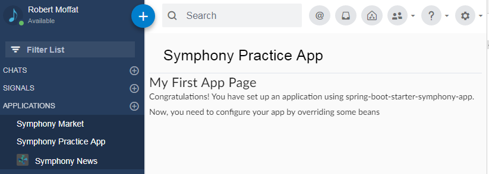

[](https://search.maven.org/search?q=com.github.deutschebank.symphony)

# spring-boot-starter-symphony-app

Add this starter to your spring boot project in order to allow it to be used as a Symphony application.   

Without configuration, this starter will create [an app](https://developers.symphony.com/extension/docs) which you can run inside Symphony, which has a single "Hello World" page module.  From there, you can customise to your own requirements.  It will look something like this:



### Step 1:  Add The Starter

Add the starter to your Spring Boot project's `pom.xml`:

```
<dependency>
  <groupId>com.github.deutschebank.symphony</groupId>
  <artifactId>symphony-app-spring-boot-starter</artifactId>
  <version> -- see above -- </version>
</dependency>
```

## Getting Started

0.  Start your Spring Boot application with the `spring-boot-starter-symphony-app` in the classpath.
1.  Head to [https://localhost/symphony-app/bundle.json](https://localhost/symphony-app/bundle.json).  This page should load.  You might need to specify a port number.  If the certificate comes up untrusted, add it [as described here](https://support.securly.com/hc/en-us/articles/206081828-How-to-manually-install-the-Securly-SSL-certificate-in-Chrome).
2.  Load the Symphony in Chrome, using this URL:  `https://<your pod>.symphony.com/client/index.html?bundle=https://localhost/symphony-app/bundle.json` 
3.  Symphony should try and load your app when it starts up.  You'll get a dialog box saying "Warning:  Unauthorized Apps(s)".  This means it has begun loading.  Click Continue.
4.  Next, Symphony will load the `url` listed in the `bundle.json` it has downloaded.  This is the Symphony Controller.  
5.  If this loads properly, the in the Applications -> Symphony Market section, you should have a new entry "Test Application".  Install this.
6.  In the left-hand navigator in Symphony, you should now have an entry saying "Test Application".  Click this and you should see a page come up saying "My First App Page" (as shown in the screenshot above).

## Features

1.  **Bundle file generation.**   This is a complex, error-prone part of Symphony app setup, and there are multiple different bundle formats. This starter moves the bundle configuration into code, with Spring configuration to override the settings.
2.  **Controller.html**: This is the main page that Symphony loads when you create your application.  Again, it's error-prone, so let this code handle it for you.
3.  **Pod Registration**: When your app is added to a Pod, you will get a registration event.  This is handled by this code.
4.  **Circle-Of-Trust**: This gives you access to the identity of the user using the application.  very treacherous to program, so again, leave it to the starter.
5.  **JWT Authentication**: Users can be authenticated via Symphony's JWT tokens when using your app.
6.  **Standard Spring Configuration**:  Your application can be completely customized using spring beans and config, overriding the defaults provided by the starter.
7.  **Local Testing Of Circle of Trust**: Normally, your app needs to be tested on the server, but this turns the debug-cycle into a nightmare.  You can speed this up with this starter.

## Bundles

The bundle file contains all of the details required to add your app to the Symphony Market on your pod.  As well as the bundle for running in-browser, you can access this URL to get a bundle file to load into the POD:

`https://localhost/symphony-app/<secret>/bundle.json`

Note: the secret is declared in the spring boot configuration (see below).  The default is `secret`, but you should change this with the `symphony.app.apiKey` parameter described below.  The secret is used by the pod to ensure that it can register with your app in a way that no-one else knows about.  

### A Note On Certificates

There are three types of certificates used by Symphony:

1.  **Bot Certificates.**  This is a type of _client_ certificate.  The common name (CN) of the cert needs to match the bot's service account name.  This starter doesn't include any of these - bots are a separate concern.  Usually, bot certificates are part of a chain, and the root or intermediate of the chain is loaded into the pod and trusted.
2.  **App Certificate**. This is a type of _client_ certificate.  App certs are self-signed, and included in the bundle file.  When the administrator loads up the bundle file into the pod, the self-signed certificate becomes trusted.  Your app will therefore need to communicate via this cert (and it's private key) going forward.  The process of creating and maintaining this certificate is managed for you by `spring-boot-starter-symphony-app`.
3.  **Server Certificate**:  This is an _ssl server_ certificate.  Your app _must_ run via HTTPS, so you will need a server certificate.  A default one is provided, which is self-signed and corresponds to the `CN=localhost`.  You should set `server.ssl.key-store` on your application to change this.  This is described in the Spring documentation [here](https://docs.spring.io/spring-boot/docs/current/reference/html/howto-embedded-web-servers.html#howto-configure-ssl).


### Configuration

Once you have the basic app running, you can configure it with the following properties (set in any normal spring boot manner).  NB, none of these are mandatory and most have sensible defaults.

|Property                              |Purpose                                                                                      |
|--------------------------------------|---------------------------------------------------------------------------------------------|
|`symphony.app.groupId`         |Needs to be a globally unique identifier for your application, used in the Symphony Market.  |
|`symphony.app.name`             |Name as it appears in the Symphony Market.                                                   |
|`symphony.app.description`    |Description for Symphony Market.                                                             |
|`symphony.app.apiKey`          |Come up with a url-safe combination of characters unique to your application.                |
|`symphony.app.publisher`      |Publisher for Symphony Market (your organisation)                                            |
|`symphony.app.permissions`   |List of app on-behalf-of permissions.  See [here](https://developers.symphony.com/restapi/docs/get-started-with-obo).  |
|`symphony.app.baseUrl`        |Base Url for your application.  Use if you are behind a load-balancer or something.          |
|`symphony.app.allowOrigins`  |Will be auto-generated, but you can override if you want.                                    |
|`symphony.app.appPath`        |Sets the path of symphony endpoints under baseUrl.  Default is "/symphony-app"               |
|`symphony.app.identity`       |A `SymphonyIdentity` object, which will contain the certificate.    If this is left blank, a certificate will be generated, otherwise, use a `SymphonyIdentity` as defined in `symphony-java-client-identity` project (included transitively). |
|`symphony.app.services`       |Services required by the application, as described [here](https://developers.symphony.com/extension/docs/using-services).  Default is all of them|
|`symphony.app.controller-javascript`|Defines the javascript that will be executed in the controller once the circle of trust is complete. Defaults to `/symphony-app/starter-include.js`, which is provided by the starter. **Override this when you create your app**          | 
|`symphony.app.controllerPath`|Allows you to set a path to use for the controller page.  If not set, will be generated for you|
|`symphony.app.circleOfTrust`|Says whether your application will perform circle-of-trust.  By default is `off`, but can be `full` or `snatch_server` (see below)|

## Controller.html

The controller handles the client-side setup of your application with symphony.  It uses a Thymeleaf template, `templates/symphony-app/controller.html`, which gets run by Symphony when you app loads into the browser.

The property `symphony.app.controller-javascript` allows you to define the javascript file to include.  The `init` method will be called, which you should define.  The arguments will be the [services](https://developers.symphony.com/extension/docs/using-services) your application uses, and the service your application defines.

By default,  `spring-boot-starter-symphony-app` includes a bean called `appPageModule`, which imports the following javascript Thymeleaf template to display the module page:

```
function init(inModules, outService) {
	const modulesService = inModules['modules'];
	const navService = inModules['applications-nav'];

	const appId = /*[[${id.commonName}]]*/ 'testing-app-id';
	const appName = /*[[${props.name}]]*/ 'My App Name';
	
	// register a new menu item on the left
	navService.add(appId+'-nav', appName, outService.name)


	// register a callback for the menu item

	outService.implement({
	        
	    select: function (id) {
	      if (id === appId+"-nav") {
	        modulesService.show(
	          appId+"-app-panel",
	          { title: appName },
	          outService.name,
	          /*[[${applicationRoot+'/symphony-app/starter-app-page.html'}]]*/,
	          { 'canFloat': true }
	        )
	      }
	    }
	});	
}
```


## Registering In The Symphony Market

You can provide the bundle file for your app to your pod's Symphony Administration team to upload into the administration console.  This will make it available in the Symphony market for all the users of the pod.  

The bundle file is available at `https://localhost/symphony-app/<secret>/bundle.json`.  Note that this bundle is not exactly the same url or format as the one you used above, to load locally (this one has the secret).

### Known Pods

Once this is loaded into your Symphony pod, you will get a callback event trying to register the Pod with your application.  This is received by the `PodInfoController` in your application. It receives a payload looking like this:

```
{
	"appId" : "cert-app-auth-example",
	"companyId" : "9999",
	"eventType" : "appEnabled",
	"payload" : {
		"agentUrl" : "https://your.agent.domain:443/agent",
		"podUrl" : "https://your.agent.domain:443/pod",
		"sessionAuthUrl" : "https://your.pod.domain:8444/sessionauth"
	}
}
```

If you _know_ the pod details already, you can configure them using the configuration approach described in the `spring-boot-starter-api` project, like so:

```
symphony:
  apis:
    - id: 4543; #this must match the companyId of your pod.
      pod:
        url: https://<your pod>.symphony.com/pod
        proxy:
          host: <your proxy host>
          user: <optional>
          password: <optional>
          port: <default 8080>
      sessionauth: 
        url: https://<your pod>-api.symphony.com:443/sessionauth
        proxy:
          ...
      keyauth: 
        url: https://<your key manager>:8444/keyauth
      agent:
        url: https://<your agent>:8444/agent
```

Then, you can ignore the registration event.  

### Unknown Pods / Symphony App Store

Alternatively, if you are expecting your app to work with multiple pods, you can configure the registration callback's `PodInfoStore` bean.   `spring-boot-starter-symphony-app` contains a default implementation of this bean (`DirectoryBasedPodInfoStore`) to store these pod details on the filesystem by setting the `symphony.app.store.location` property (a spring resource). e.g.

```
symphony.app.store.location: file:pod-store
```

This way, when new pods install your application, you will know how to perform the circle-of-trust with them.

If you want to store them somewhere else, you will need to provide your own implementation of this bean.

## Circle Of Trust

This is documented by Symphony [here](https://developers.symphony.com/extension/docs/application-authentication).  It is complex.  This starter handles it all for you if you set `circleOfTrust=FULL` parameter.

Once you have the application inside the Symphony Market, the pod will know where the application is, and (because of the callback) the application will know where the pod is.  The circle of trust validates the two backends and the two front ends (your app and the symphony client) by passing tokens between each other.

You may want to override `AppTokenStrategy` bean.  This generates an app token for your application.  It is also responsible for checking a match between the pod token and your app's token.  The default implementationis `NoopAppTokenStrategy`, which generates the app token, but always returns <true> for the trust part.  Probably if you are going to use this app outside a corporate environment you might want to check for token matches.  

## Local Testing With Circle-Of-Trust

It can be a pain to continually have to redeploy your server code in order to test functionality with circle-of-trust.  If you use the `NoopAppTokenStrategy` you can have both a local version of your app running (via `bundle=` url parameter) and the server version and load them both at the same time.  The only problem with this is that all your javascript callbacks are set up twice, and you have a confusing mess as two applications are running together.

You can skirt around this problem by running your local (`bundle=`) version with `circleOfTrust=full` and the server version with `circleOfTrust=snatch_server`.  This means that the server handles all the circle-of-trust callbacks, but doesn't load the javascript up.

## JWT Authentication

Once you are running with a circle-of-trust, you can use JWT to secure your application.  To do this, set `symphony.app.jwt=true` in your Spring config.  The JWT token contains a field `companyId` which identifies your pod, and from the pod registrations, we can use this to download the certificate to check the JWT token.

You can see this working in the `UserDetailsController`, which returns JSON containing the contents of the JWT token.  This endpoint is invoked by the default app-page (bean named `appPageHtml`, which you should override in your own code).

`spring-boot-starter-symphony-app` imports `spring-boot-starter-security`.  That's because you can't create symphony apps which _don't_ use `https`.  However, you will need to further customize your security settings within your own app.

## Extending the Starter

- All of the setup for this starter is in `SymphonyAppConfig`.  
- All of the beans defined there can be overridden.  
- At a minimum, you will probably want to override `symphony.app.controller-javascript` setting, to provide your own controller javascript. 
- You'll want to define a spring `@Controller` to return some new javascript, and any other pages your application needs.


## Tutorial

 - [Read the App-Building Tutorial](tutorials/Spring-Boot-App.md)


