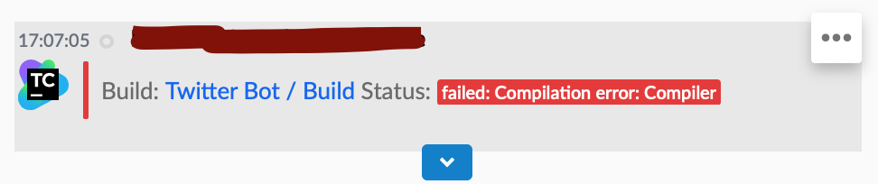
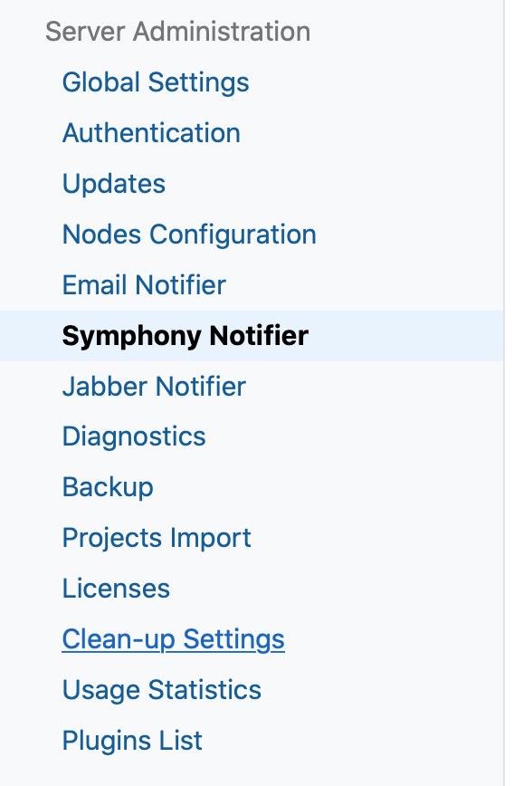
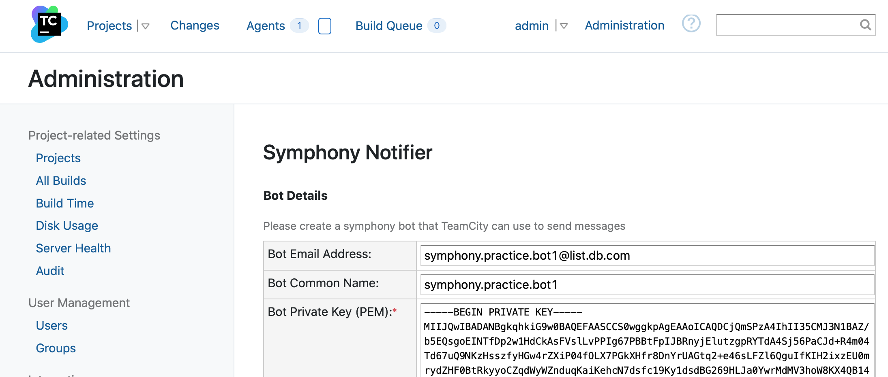
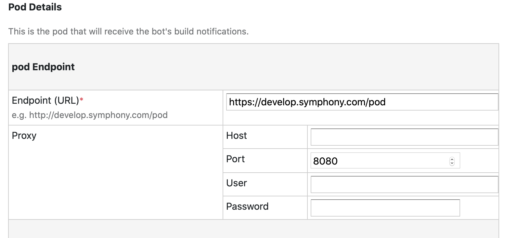
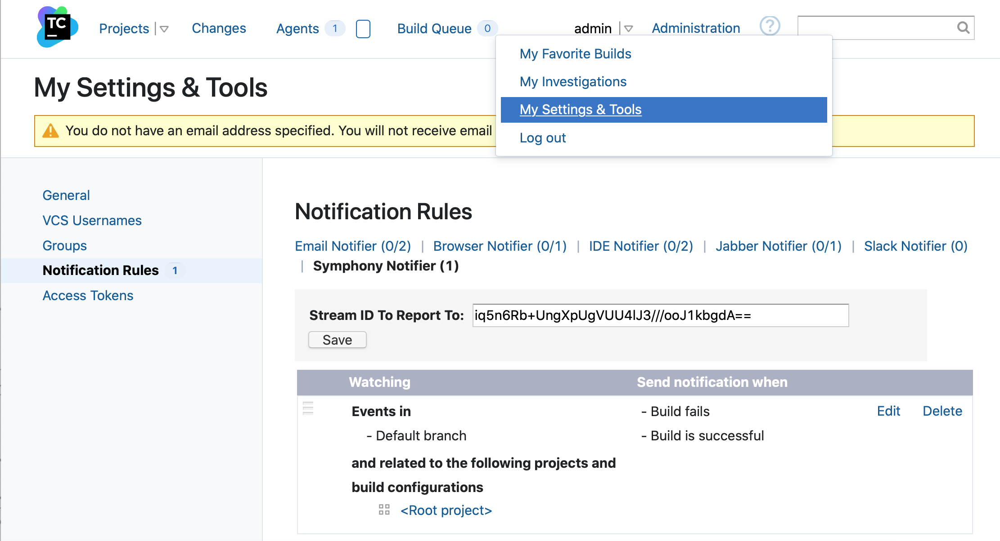
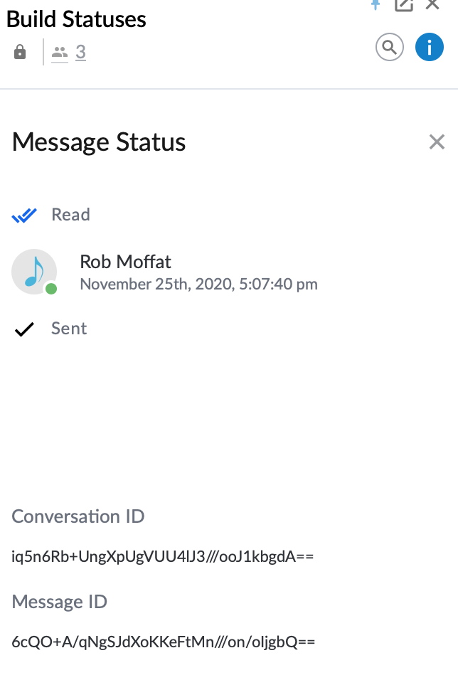

# TeamCity Symphony Notifier

A configurable TeamCity plugin that notifies your [symphony](https://symphony.com) channel.

Because it is a [TeamCity Custom Notifier](http://confluence.jetbrains.com/display/TCD8/Custom+Notifier) plugin, it extends the existing user interface and allows for easy configuration directly within your TeamCity server. Once installed, you can configure the plugin for multiple TeamCity projects and multiple build conditions (i.e. Build failures, successes, hangs, etc.)

## Installation

1. Download the [plugin zip package](https://github.com/finos/symphony-java-toolkit/releases/download/5.59.1/teamcity-symphony-integration.zip).

2. Follow the TeamCity [plugin installation directions](http://confluence.jetbrains.com/display/TCD8/Installing+Additional+Plugins).

## Admin Configuration

- In order for notifications to work, we need give TeamCity our bot and pod details.

1. **Choose "Symphony Notifier" from the Administration Menu in TeamCity.**

2. **Enter the bot details.**  Usually, you will only need to enter the common name, email and the private key of your bot.  However, some environments additionally require the use of bot certificates.  Add these in if needed.

3. **Set the Endpoint Details**.  You will need to provide URLs for the various endpoints of symphony. Examples are given, it's usually only necessary to change the host part of the URL to your pod.  However, in some corporate environments, you may need a proxy to access symphony, or you might be running the agent or keymanager on an internal URL.  Enter these here.

4.  **Save the Page**.  Your connection details will be tested.

5.  **Trust Manager Details**.  If your organisation is running with some bizarre certificates for symphony, you can enter these in the box provided, to allow TeamCity to trust the Symphony servers.  This probably won't be used very often.

6.  **Templates**:  You can supply your own FreeMarker template here, which you can design in MessageML using [The Renderer Tool](https://renderer-tool.app.symphony.com).  Leave the box blank to use the default.

## User Configuration

Once you have configured the bot, you need to set up the notifier for your user.  Go to "My Settings And Tools" -> Notification Rules, and you should see the Symphony Notifier listed.

You will need to supply your stream ID.  You can get this by:

1.  Create a new room or chat with the TeamCity Bot (you set up in the admin details, above)
2.  Send a message in the room
3.  Click on the time of the message to pop up the below window:

4.  Copy the "Conversation ID" out of this field, and place into the TeamCity configuration screen.
