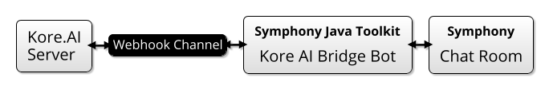
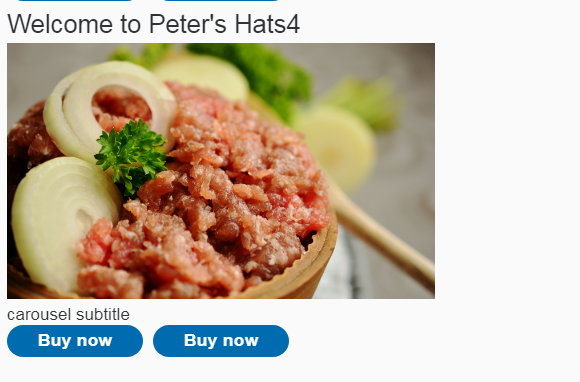
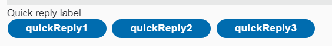
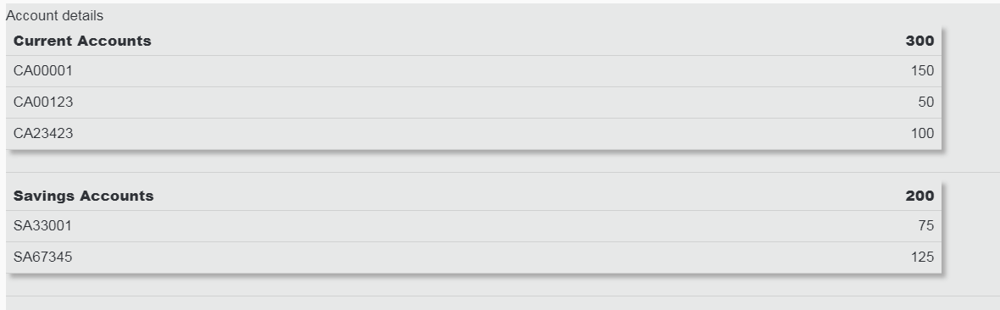
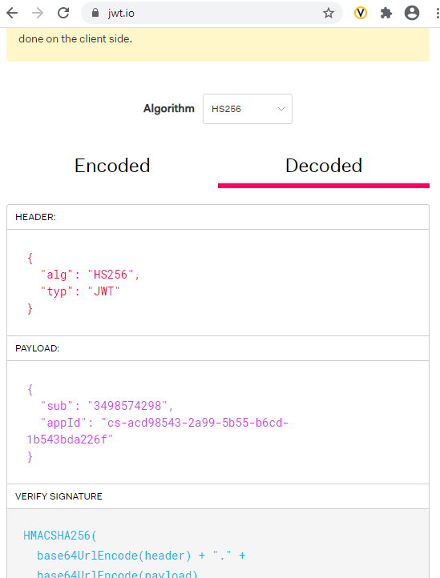

# KoreAI Bridge

This is a Spring Boot App that acts as a middleman between a Symphony bot and a KoreAI bot, allowing you to expose your KoreAI bot as a bot on Symphony.  [Kore.AI](https://kore.ai/) is a low code/no code environment for building chat bots.

It is intended that you can deploy this bot as-is, either standalone or clustered (see configuration of [Shared Stream](../../libs/shared-stream-spring-boot-starter/README.md)), providing just configuration to get it to talk with Kore AI.

It is possible to include multiple KoreAI bot/symphony bot pairs in the configuration, allowing the bridge to wire up multiple bot-pairs.

## Template Examples

The Kore.AI Bridge bot is capable of converting various different Kore AI responses into Symphony Message ML.  In addition, you can add extra templates for new content types, if Kore AI decide to produce any more.

## Steps To Set Up

1.  Create Your Kore AI Bot.
2.  [Create a Kore AI webhook channel](https://developer.kore.ai/docs/bots/channel-enablement/adding-webhook-channel/).
3.  Configure The KoreAI Bridge Bot (see below)
4.  Run it.

## Configuration

### JWT Token

Follow instructions [here](https://developer.kore.ai/docs/bots/api-guide/apis/) to generate a JWT token from your application secret.

### Application.yml

You will need to add these details along with all the other bot connection details into your `application.yml` file.  You can find a sample in [application-example.yml](application-example.yml).   

## Troubleshooting

### 1. JWTs

We had a lot of trouble getting a valid JWT for our Webhook.  Make sure you create the channel with HS256 format, and use jwt.io to create the token.  We had to add a `subId` (with some random number) like so:

### 2. Missing Responses

When you set up your bot, you need to make sure that you tell it to publish the content to the Webhook channel - it's possible in KoreAI for the bot to respond with different messages on different channels.
