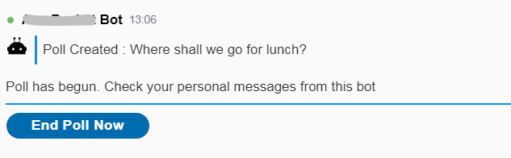

# Poll Bot

This provides a Poll bot, to demonstrate the [Chat Workflow](../../chat-workflow-spring-boot-starter/README.md) module.

Here are some images of it working:

Enter a question and some options...

The poll has started.  

Members of the room receive private messages asking them to vote...

After the poll closes, a chart is displayed of the results.
