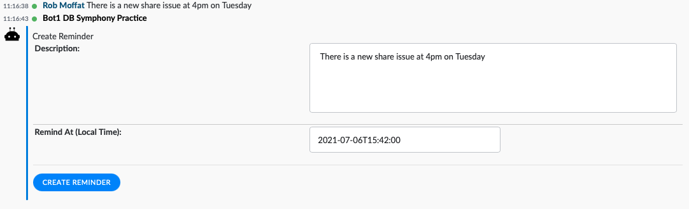
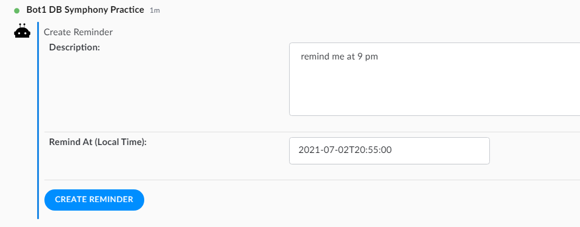
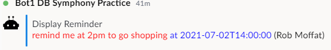
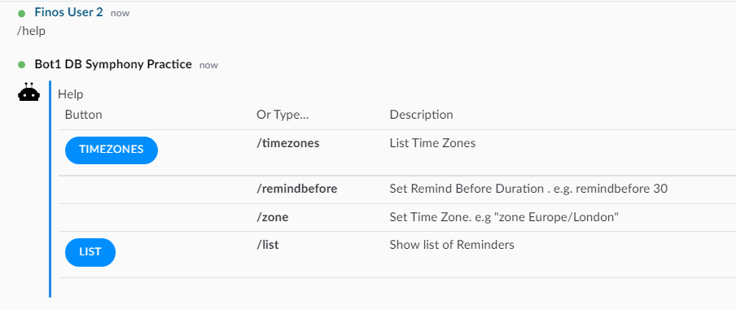
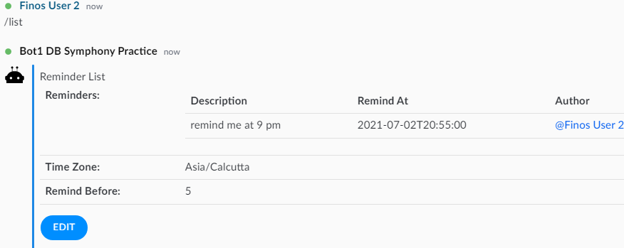
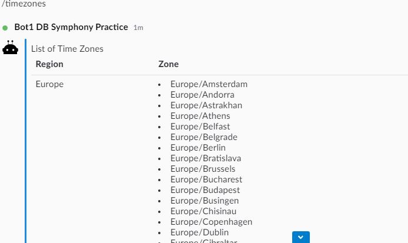
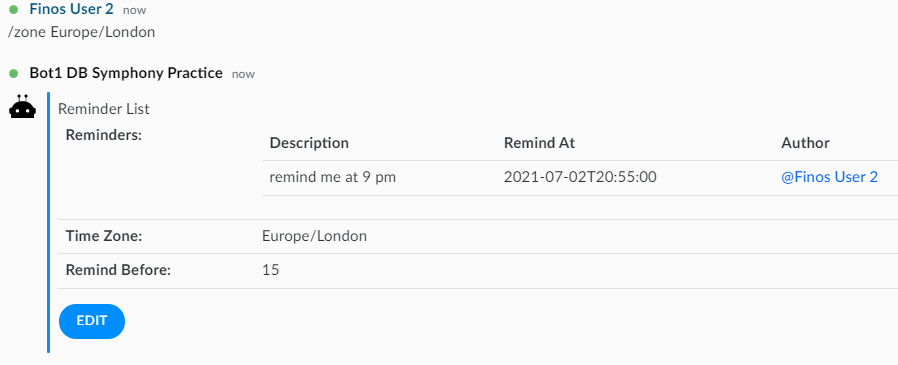
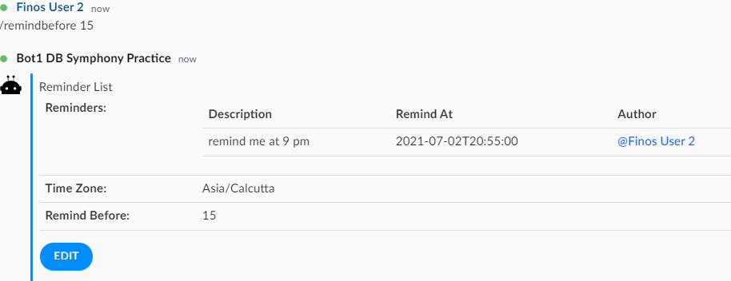

# Reminder Bot

Reminder Bot acts as your personal assistant.  It will set up reminders for dates / times mentioned in a room, and send you a reminder message when those times occur, like so:



## Setup & Use

 - 1.   Simply add the Reminder Bot to any chat, and it will monitor all the messages for a date/time component.
 - 2.   Chat with the bot. When you enter a date/time the bot will respond with a form allowing you to create a reminder:



 - 3.   Clicking Create Reminder will add the reminder to the list of reminders active in the room.


 - 4.  When the time arrives, the Reminder Bot will notify in the chat like so:
 


## Chat-Level Configuration

Options include : 

- Listing down the reminders for the room
- Listing down the timezones
- Changing time zone , remind before duration
- Changing the "remind before" / "travel time" for the room.

Type `/help` in the room to display all the options, as shown below:



### Showing reminders in the room 

Type `/list` in a chat to show the reminders set for the current room:



### Changing Timezone

Type `/timezones` in the room to show all the available timezones: 



Type `/zone Asia/Calcutta` to update the timezone for the room.



### Changing Remind Before

You can set the lead-time for each reminder seperately, but you can set a default remind-before in each room like so:

`/remindbefore 5`



This means, if later you enter "remind me at 6pm to make dinner", then the reminder will come up at 5:55pm, as you have set a 5 minute remind-before.


## Bot-Wide Configuration

This is done in the `application.yml` file.  

### Override the Welcome Message

``` 
symphony:
  reminder:
    welcomeMessage:  "The reminder bot is active in this room.   Type a date or time in your conversation and I'll create a reminder for it" 
    
```

### Set the Default TimeZone For New Rooms / Chats

By default, time-zone is set to London, but you can override with any Java timezone like so:

``` 
symphony:
  reminder:
    defaultTimeZone:  "America/Los_Angeles" 
    
```

Users can override this on a per-chat basis with `/zone` (descibed above).


### Set Default Remind-Before

``` 
symphony:
  reminder:
    defaultRemindBefore:  30  # 30 minutes before.
```

## License Warning

Reminder Bot uses Stanford NLP library, which is licensed under **GNU General Public License Version 3**.  If you make derivative works of this code you will need to license them under a similar license.
