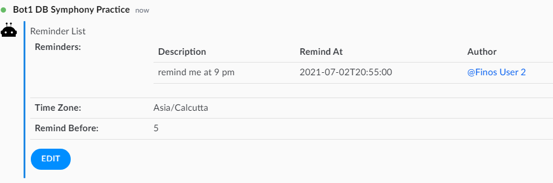

 # Reminder Bot

Reminder Bot acts as your personal assistant by sending you reminders 
To send a Reminder , add the Reminder bot to symphony room and type in a message in Symphony room with time component involved.
Help options include : 
Listing down the reminders for the room
Listing down the timezones
Changing time zone , remind before duration


# How To Use
Add reminder bot to a symphony room (referred to as THE ROOM going ahead)

# Creating a reminder :

Type in a message with time component.Create Reminder confirmation will be asked :


Clicking Create Reminder will add the reminder to the ReminderList of THE ROOM


# Help options

Type /help in THE ROOM . Options display .


#Listing down reminders in the room 

Type /list in THE ROOM. ReminderList for the room displays.


#Listing down Available TimeZones

Type /timezones in THE ROOM. Available TimeZones display.


#Changing Timezone

Type /zone Asia/Calcutta in THE ROOM. Timezone for the room updates.


# Displaying Reminders

At the Stipulated time, User is notified with the reminder : 


### Override the Welcome Message

``` 
symphony:
  reminder:
    welcomeMessage:  "The reminder bot is active in this room.   Type a date or time in your conversation and I'll create a reminder for it" 
    
```

### Set the Default TimeZone

By default, time-zone is set to london, but you can override with any Java timezone like so:

``` 
symphony:
  reminder:
    defaultTimeZone:  "America/Los_Angeles" 
    
```
Type /zone Asia/Calcutta in THE ROOM. Timezone for the room updates.


### Set Remind-Before

By default, if you chat to the bot "Remind me to go to town at 8pm" you'll get a reminder at 8pm.  You can change the exact time of the reminder when you create 

However, if you want your reminders _earlier_ by default you can configure this site-wide for the bot:

``` 
symphony:
  reminder:
    defaultRemindBefore:  30  # 30 minutes before.
```
updating remindbefore can be achieved by :

/remindbefore 5

