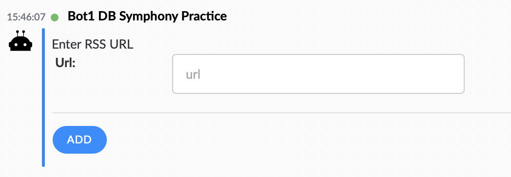

# RSS Bot

This provides a simple bot that is able to publish RSS news articles into a chatroom, by consuming RSS feeds.  The RSS feeds are configurable by the members of the room.  As usual, type /help to get the bot to provide help information.  This is standalone, and just requires `application.yml` to run (no database needed).

Add the bot to a room (or 1-1 chat) and type /help to begin configuring your RSS feeds in Symphony.

## Some Screenshots

### Main Menu


Type help to get the menu

### Subscribed Feeds


Subscribe to multiple feeds in a single room

### News Articles


News arrives into your room on a configurable schedule

### Filters


You can filter in/out keywords from the news articles

### Add A New Feed



Just drop in the URL of a feed to configure it.

## Other Features

### Schedule       
       
You can set the schedule (in minutes) for each room the bot is in by typing '/every {x}'.  

### Room-Admins Only

You can type '/makeAdminOnly' to permit only room admins to change the feeds.  '/notAdminOnly' will reverse this.

## Configuration

### Proxies

You can configure the bot to use proxies to collect the data. This follows the same format as `symphony-api-spring-boot-starter` e.g.

```
symphony:
  rss:
    proxies:
      - host: somehost.com
        port: 8080
      - host: <none>
      - host: someotherhost.com
        port: 8090
```

The RSS bot will initially try each proxy in turn to set up the feed, and then store the correct proxy with the feed for later use.       
       
    
### Success / Failure Messages

You can customize the messages returned to the user when they set up an RSS Feed:

```
symphony:
  rss:
    successMessage: "Your RSS Feed Is Configured!"
    failureMessage: "Failed to set up - please talk to Pete"
```
    
       
### Observation Stream   

To monitor the details of the RSS stream that have been set up, create an observation room, and add your support team to it.  Add the RSS bot to the room too, and configure the stream id in the `application.yml` file:

```
symphony:
  rss:
    observationStream: PfY25Q2nATxpHfVqkWMAkH///ogG8demdA==
```

## Things To Note

- In this example, we are using the chat-workflow module to define the "look" of the messages with the bot.  
- We use the article messages themselves to track what has already been published in the room.
- The `FeedList` object is held in the room - this contains the details of the feeds you've subscribed to.
- We have custom Freemarker templates for the look of the articles and the feedlist.
- We're using Spring's Scheduling to download the feeds every hour.
- Every month, we pause the feed and send a message to the user asking them to resume it.  This stops the bot posting to rooms that aren't interested anymore.

