# To-Do List Bot Using Chat Workflow

This tutorial will take you through the process of creating a new chat workflow application
and running it inside the Symphony container.

We're going to build a "To Do" list with the following features:

- One to-do list per Symphony room/chat
- Anyone in the room can create a new item and add it to the list (potentially assigning the item to someone)
- Ability to edit the details of any item
- Bulk assign / remove / mark complete of items 

It's going to look something like this:

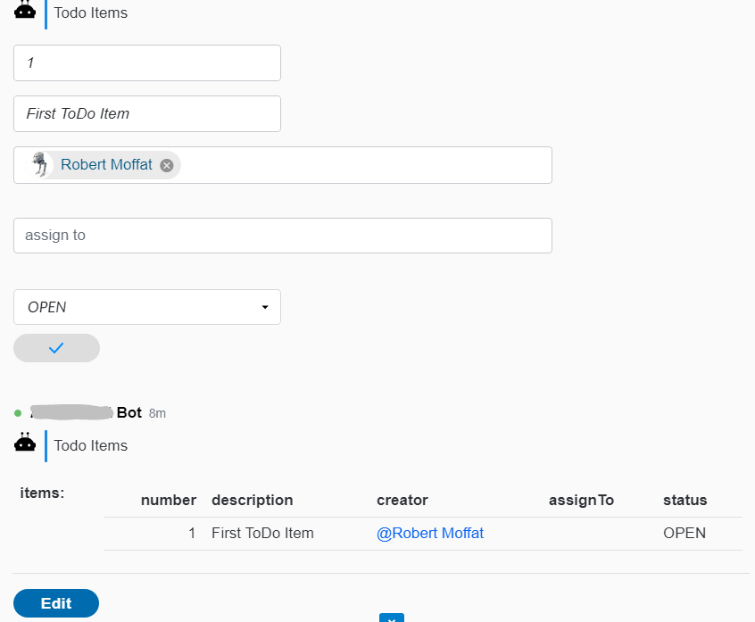

If you want to cheat, you can view the code for this [here](../demos/demo-todo-bot).

Let's go!

## 1. Create a New Spring Boot Project

Let's head over to `https://start.spring.io` and create a new app
project:

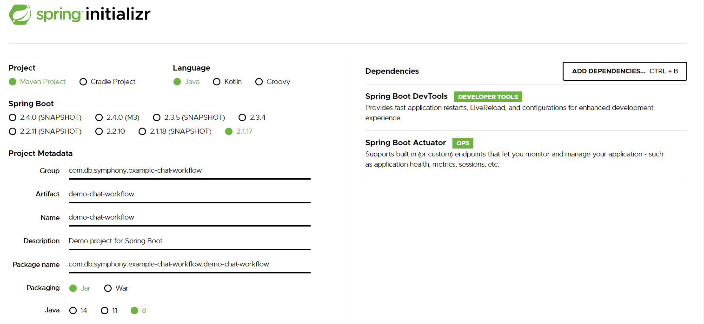

-   I've created a maven project, with actuator and devtools support
    built in.
-   When you click download, it will deliver a zip file which you can
    unpack in your file-system.

## 2. Import Into Your IDE


In this image, I'm downloading and unpacking Spring's zip file.  Next, I'm going to import the project
into Eclipse, but  If you are using a different IDE, substitute your step here.

Here is my project in eclipse:

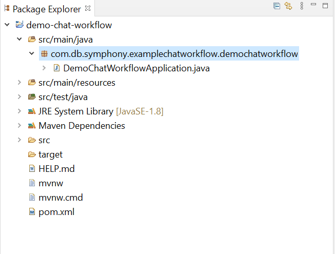

-   If I run the project now, I should see Spring start, and then finish
    (as we haven\'t actually added any code).

## 3. Add The Spring-Boot-Starter-Symphony-Chat-Workflow Dependency

In `pom.xml` add these dependencies:

```
<dependency>
	<groupId>com.github.deutschebank.symphony</groupId>
	<artifactId>chat-workflow</artifactId>
	<version>--latest version --</version>
</dependency>
<dependency>
  <groupId>org.apache.cxf</groupId>
  <artifactId>cxf-rt-rs-client</artifactId>
  <version>--latest version --</version>
  <scope>compile</scope>
</dependency>
```

Latest version: 


## 4. Some Beans

We're going to create 3 simple Java beans:

1.  `ToDoList`:  This will be our main todo list bean.  It will have a property containing a bunch of `ToDoItem`s
2.  `ToDoItem`s:  Each item in the `ToDoList` will be one of these.  It will have a description, creator etc.
3.  `NewItemDetails`s:  This is a form containing two fields - `description` and `assignTo`, and we'll use this for capturing a new `ToDoItem`.

### `ToDoList`

```
@Work(name = "Todo Items", instructions = "List of current items", editable = true)  (1)
public class ToDoList {

  @Valid
  private List<ToDoItem> items = new ArrayList<ToDoItem>();                          (2)
  
  public List<ToDoItem> getItems() {                                                 (3)
    return items;
  }

  public void setItems(List<ToDoItem> items) {
    this.items = items;
  }

  @Exposed(description = "Create new item list")                                     (4)
  public static ToDoList init() {
    return new ToDoList();
  }
```

This is the entirety of `ToDoList` (for now).  The interesting features are:

1.  The `@Work` annotation, which provides a human-readable name and instructions for people editing the list.  Note it also has `editable=true`.  This means that people in the chat room can edit the list.
2.  This is our list of `ToDoItem`s.
3.  Getter/Setter for the `ToDoItem`s.  (Following normal Java Bean conventions - this is important for JSON serialization.)
4.  The `@Exposed` annotation marks a method as being callable by users in a chat room.  Generally, they will type `/init` to create a new `ToDoList` in a room containing our To-Do List Bot.  Note, you could put _any code you like_ here: maybe downloading the ToDo items from a Github issues list? Or Jira?  Up to you.

### `ToDoItem`

```
@Work(name = "Item", instructions = "Add/Edit the Item")                             (1)
public class ToDoItem { 

  public enum Status {                                                               (2)
    OPEN, COMPLETE
  };
  
  private Integer number;                                                            (3)
  private String description;
  private User creator;                                                              (4)
  private User assignTo;
  private Status status;

  public ToDoItem() {                                                                (5)
    super();
  }

  public ToDoItem(String description, User creator, User assignTo, Status status) {
    super();
    this.description = description;
    this.creator = creator;
    this.assignTo = assignTo;
    this.status = status;
  }
  
  // getters and setters ...                                                         (6)
 
}
```

Some notes on this:

1.  As with `ToDoList`, we add the annotation, which will be used to decorate the class in the chat.
2.  `Status` is going to keep track of whether the `ToDoItem` has been done or not.
3.  To make it easy to refer to items, we're going to give them all a unique number in the To Do List.  This makes it easier to do the bulk operations later on in the tutorial.  (You could choose some other way to refer to each item - a hash-tag would be good, for example).
4.  `User` is a special class meaning a Symphony User.  We'll be given a picker to choose these.
5.  The no-args constructor is important to make this a Java Bean.  This is only needed if you have an args-based constructor (which we do).
6.  Again, getters and setters to make this a Java Bean. 

### `NewItemDetails`

This is super-simple - another bean for the details of a new item.  We capture the description of the item, and who to assign it to.

```
@Work(name = "New Item", instructions = "Add the new item")
public class NewItemDetails {
  
  String description;
  User assignTo;
  
  public NewItemDetails() {
    super();
  }
  /**
   * @return the description
   */
  public String getDescription() {
    return description;
  }
  /**
   * @param description the description to set
   */
  public void setDescription(String description) {
    this.description = description;
  }
  /**
   * @return the assignTo
   */
  public User getAssignTo() {
    return assignTo;
  }
  /**
   * @param assignTo the assignTo to set
   */
  public void setAssignTo(User assignTo) {
    this.assignTo = assignTo;
  }
  
}
```

## 5. A Workflow Spring Bean

`chat-workflow` defines the Symphony bot for you, but it needs to know about the workflow classes we've created.  We need a Spring bean that implements `com.github.deutschebank.symphony.workflow.Workflow` to describe this, and for our To Do app, it looks like this:

```
@Configuration
public class WorkflowConfig {

  @Bean
  public Workflow appWorkflow() {
    ClassBasedWorkflow wf = new ClassBasedWorkflow(WorkflowConfig.class.getCanonicalName());
    wf.addClass(ToDoItem.class);
    wf.addClass(ToDoList.class);
    wf.addClass(NewItemDetails.class);
    return wf;
  }
}  
```

Here, we are using Spring's Java config to describe a bean implementing `Workflow`.  We are using the `ClassBasedWorkflow`, which allows us to simply specify the classes involved in the workflow, which we are doing, using `addClass` to add `ToDoList`, `ToDoItem` and `NewItemDetails` which we defined in Step 4.

## 6. `application.yml`

We're nearly ready to run this for the first time, but we need to supply some configuration.  This is done in spring with the `application.yml` file.  We covered this in the [Spring Boot Bot Building Tutorial](Spring-Boot-Bot.md)  

An example is checked into the demo project here: [application.yml](../demos/demo-todo-bot/application.yml)

## 7. Run It

If all goes well, we can talk to our bot in a chat room like this:

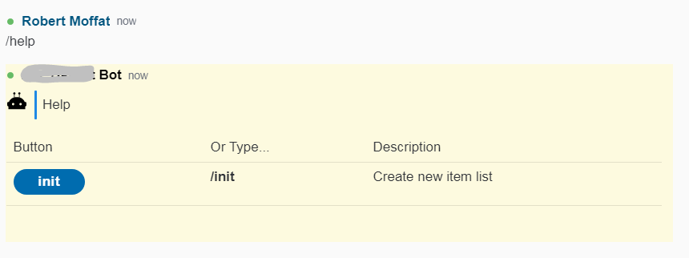

I can click "init" or type `/init` in the room and get this:

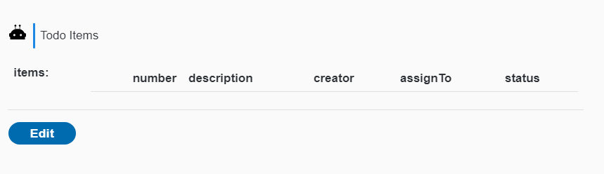

This is the empty `ToDoList` object rendered on screen, which was returned by calling the `ToDoList.init()` method in Java.

I can click **Edit**:


And, although there are no rows to delete, I can click **New** to add something:

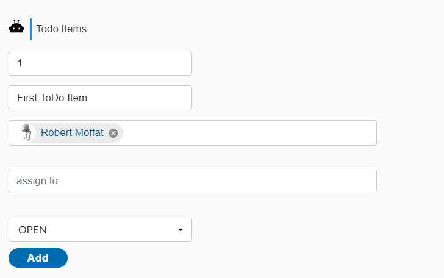

Having filled out the form, I can see my new item in the To Do List:

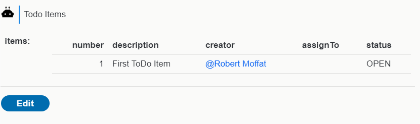

## 8. Improving The "Add Item" Workflow

So, very quickly, we've created a way to edit a Java object in Symphony.  This is nice, but it's far from completely efficient:  adding new items is a bit of a pain, and there are several steps involved in updating the list.  So, let's wire in the `NewItemDetails` class, like this:

```
public class ToDoList {

  // earlier stuff

  private void reNumber() {
    int initial = 1;
    for (ToDoItem toDoItem : items) {
      toDoItem.setNumber(initial++);
    }
  }
  
  @Exposed(description = "Add an item")
  public ToDoList add(NewItemDetails a, Author u) {
    this.items.add(new ToDoItem(a.getDescription(), u, a.getAssignTo(), Status.OPEN));
    reNumber();
    return this;
  }

}
```

So here we're adding two new methods to `ToDoList`.  `reNumber()` simply goes through the items of the `ToDoList` and sets their ordinal number in the list.  This is going to be more useful later, but we are at least using it in the `add()` method.

Here, we take a `NewItemDetails` instance, and build a `ToDoItem` out of it.  That means the user can now type `/add` and fill out a form, like so:

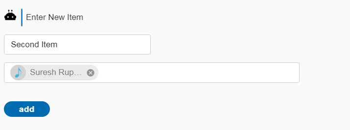

When we submit the form, we get back the (correctly numbered) list of items.  

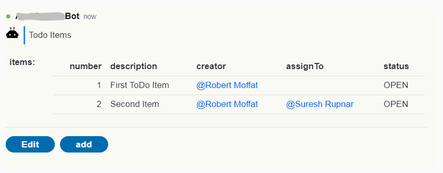

Note this form now has the **add** button at the bottom of it.  And `/help` also shows **add** too:

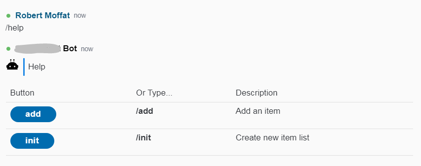

Now, you might well ask what parameters a workflow method like `add()` can have.  The [README](../chat-workflow/README.md) goes into more detail on this.

## 9. Returning State

Often, the state of your To Do list gets lost in the history of the chat. It's nice to be able to recall it at a moment's notice.  For this, we're going to implement `/show`:

```
public class ToDoList {

  // earlier stuff

  @Exposed(description = "Show current list of items")
  public ToDoList show() {
    reNumber();
    return this;
  }
  
}
```

This works as shown here:

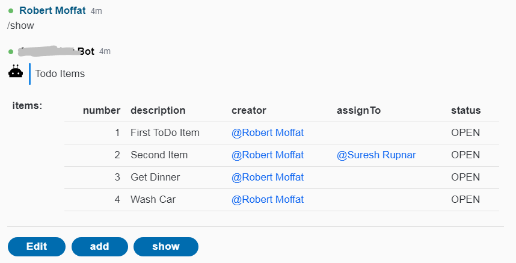

Note you can click the **show** button, or you can type `/show`. 

## 10. Improving The Update Workflow

It would be nice to manage the To-Do list without diving into the edit forms quite so much.  How about:

```
/assign 1 2 3 @Robert Moffat
/delete 1 2 3
/complete 4 5 6 @Suresh Rupnar
```


Those would be some useful things to be able to type to the bot!  How can we achieve that?  Let's start with the delete command.

```
  private Integer parseInt(Word w) {
    try {
      return Integer.parseInt(w.getText());
    } catch (NumberFormatException nfe) {
      return null;
    }
  }
  
  private Set<Integer> numbers(Message m) {
    return m.only(Word.class).stream()
      .map(w -> parseInt(w))
      .filter(i -> i != null)
      .collect(Collectors.toSet());
  }

  @Exposed(isButton = false, description = "Remove items by number. e.g. \"/delete 5 6 7\"")
  public ToDoList delete(Message m) {
    Set<Integer> toRemove = numbers(m);
    for (Iterator<ToDoItem> iterator = items.iterator(); iterator.hasNext();) {
      ToDoItem item = iterator.next();
      if (toRemove.contains(item.getNumber())) {
        iterator.remove();
      } 
    }
    reNumber();
    return this;
  }
```

Let's break down what's happening here.  

- `parseInt()` is simply wrapping the `Integer.parseInt` method from Java, except using `Word`, which represents a word that the user types in.  We return `null` if the `Word` wasn't a number.
- `numbers()` takes a message and converts it into a `Set` of numbers.  We can use `only()` on the message to get back just the `Word`s in the message (i.e not `Tables`, `HashTag`s or anything else.
- `delete()` is where the action happens.  We are simply iterating over the `ToDoItem`s, and seeing if the user gave the number for any of them, and deleting it if so.  Note `@Exposed` has `isButton=false`.  This means the method _wont_ appear as a button in the help menu (only text).  

It looks like this:


Now we can issue our command like this:

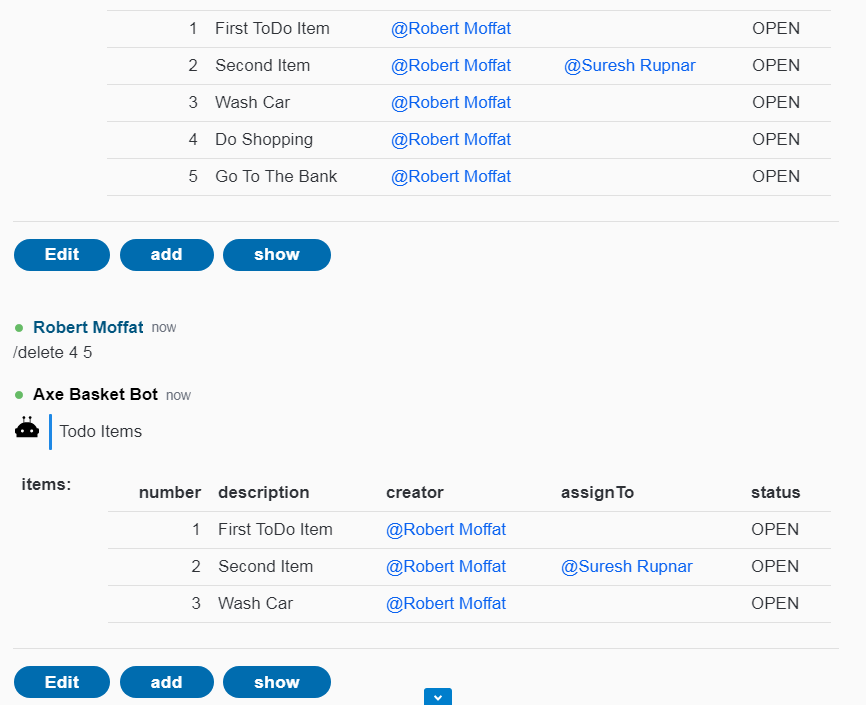

## Assign / Complete

Let's do the `/assign` and `/complete` commands together:

```

  private void changeStatus(Message m, User u, Status s) {
    Set<Integer> toUpdate = numbers(m);

    items.stream()
      .filter(i -> toUpdate.contains(i.getNumber()))
      .forEach(i -> {
        i.setAssignTo(u); 
        i.setStatus(s);
    });
    reNumber();
  }
  
  @Exposed(isButton = false, description = "Complete items, e.g. \"/complete 1 3 5 @Suresh Rupnar\"")
  public ToDoList complete(Message m, Author a) {
    User u = m.getNth(User.class, 0).orElse(a);
    changeStatus(m, u, Status.COMPLETE);
    return this;
  }

  @Exposed(isButton = false, description = "Assign items, e.g. \"/assign 1 3 5 @Suresh Rupnar\"")
  public ToDoList assign(Message m, Author a) {
    User u = m.getNth(User.class, 0).orElse(a);
    changeStatus(m, u, Status.OPEN);
    return this;
  }

```

- `changeStatus()` goes through the items in the `ToDoList` and assigns each one mentioned in the message to the `User u` with `Status s`. 
- `complete()` and `assign()` both use `changeStatus()`.  If a user is  mentioned, they'll assign to that user, otherwise, they'll assign to the person issuing the chat command (i.e. the `Author`).  

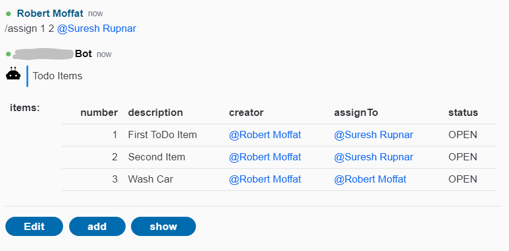

## Templating

If you don't like the look of the forms presented, you don't have to stick with them!  Take a look a the [README](../chat-workflow/README.md), which covers how to customize your templates.  In the standard out logging for your bot, you will find sources which you can use as the basis for your templates.  e.g.

```
2020-10-15 17:26:01.339  INFO 21628 --- [ SymphonyStream] c.g.d.s.w.s.s.h.SymphonyResponseHandler  : JSON: 
{
  "workflow_001" : {
    "type" : "example.symphony.demoworkflow.todo.toDoList",
    "version" : "1.0",
    "items" : [ 
      ...
    } ]
  },
  "errors" : {
    "type" : "com.github.deutschebank.symphony.workflow.form.errorMap",
    "version" : "1.0",
    "contents" : { ... }
  },
  "buttons" : {
    "type" : "com.github.deutschebank.symphony.workflow.form.buttonList",
    "version" : "1.0",
    "contents" : [ ... ]
  },
  "header" : {
    "type" : "com.github.deutschebank.symphony.workflow.form.headerDetails",
    "version" : "1.0",
    "name" : "Todo Items",
    "description" : "List of current items",
    
  }
}
2020-10-15 17:26:01.340  INFO 21628 --- [ SymphonyStream] c.g.d.s.w.s.s.h.SymphonyResponseHandler  : TEMPLATE: 
<messageML><card accent="tempo-bg-color--blue">
  <header>${entity.header.name}</header> 
  <body>
    <p>${entity.header.description}</p>
    <ul>
      <#list entity.header.tags as tag>
        <li><hash tag="${tag.id}" /></li>
      </#list>
    </ul>
  </body>
</card>
     
<#-- starting template -->
<table><tr><td><b>items:</b></td><td>
 <span class="tempo-text-color--red">${entity.errors.contents['items']!''}</span>
 
 <table><thead><tr>
   <td style="text-align: right;"><b>number</b></td>
   <td ><b>description</b></td>
   <td ><b>creator</b></td>
   <td ><b>assignTo</b></td>
   <td ><b>status</b></td>
 </tr></thead><tbody>
 <#list entity.workflow_001.items as iA>
 <tr>
  <td style="text-align: right;">${iA.number!''}</td>
  <td >${iA.description!''}</td>
  <td ><#if iA.creator??><mention 
   uid="${iA.creator.id}" /></#if></td>
  <td ><#if iA.assignTo??><mention 
   uid="${iA.assignTo.id}" /></#if></td>
  <td >${iA.status!''}</td></tr>
 </#list>
 </tbody></table></td></tr>
</table>
<form 
 id="just-buttons-form">
  <p><#list entity.buttons.contents as button>
    <button 
         name="${button.name}"
         type="${button.buttonType?lower_case}">
      ${button.text}
    </button>
  </#list></p>
</form>
<#-- ending template -->
</messageML>
```

You can load this into the [PresentationML editor](https://renderer-tool.app.symphony.com/) like this:

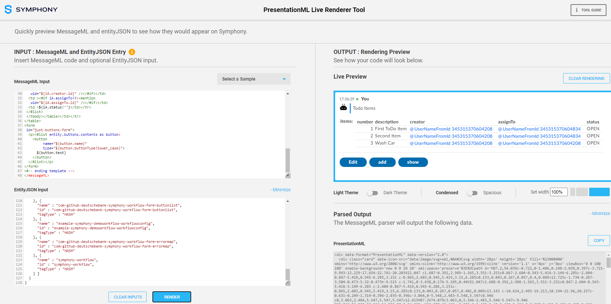
