# Spring-Bot With Microsoft Teams Tutorial

## Create a Teams Developer Account

You can apply for a 90-day developer account that allows you to set up an instance of Microsoft Teams with up to 20 different users.   This allows you to work with colleagues to build and test a bot.

- You can apply for this [here](https://developer.microsoft.com/en-us/microsoft-365/dev-program)

- Create some user accounts and distribute them to your friends.

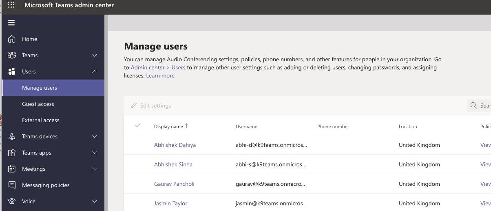

- With your own account, you should be able to log into Microsoft Teams with your `onmicrosoft.com` email:

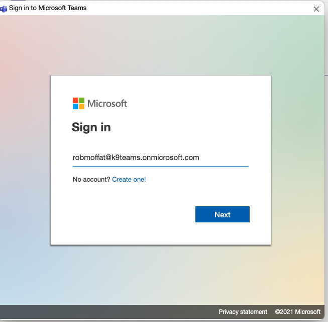  

- From here, you can explore the delights of Microsoft Teams, and talk to any friends you invited.

## Create an App Manifest on The Teams Developer Portal

You can access the Teams Developer Portal [here](https://dev.teams.microsoft.com/home).

We are going to create an `App`, which is something that is available in the Teams App Store, and can be installed into your Teams chats.   An `App` can contain a number of `bot`s.  Here, we'll just create one. 

- Click `New App`

-  Name The App

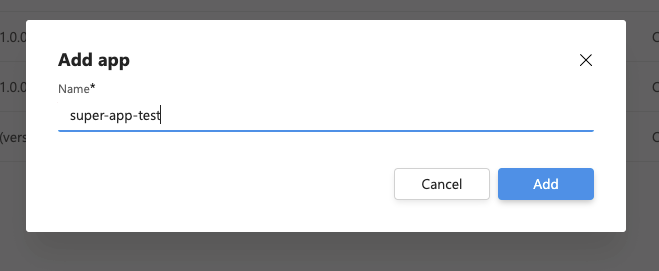

- Select App Features

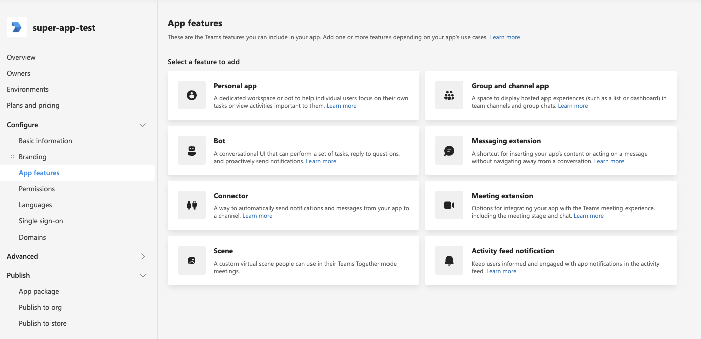

- Click "Bot"

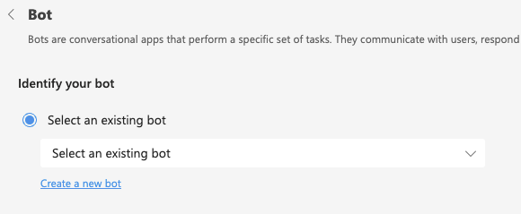

- Create a new bot and give the bot a name

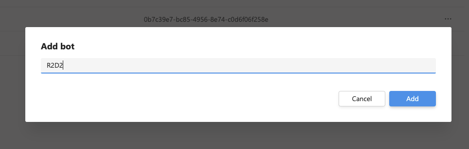

- Create a Client Secret, and keep this somewhere

- Fill out the privacy policy, terms of use:

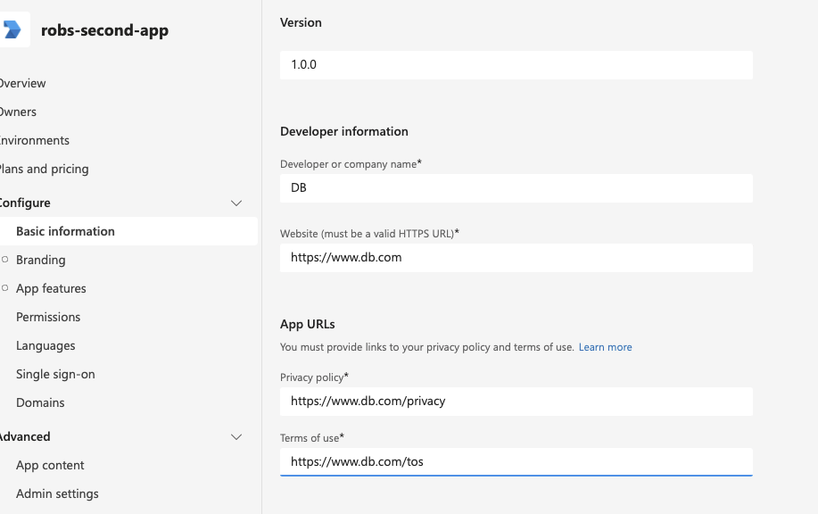

- Give The App Some permissions

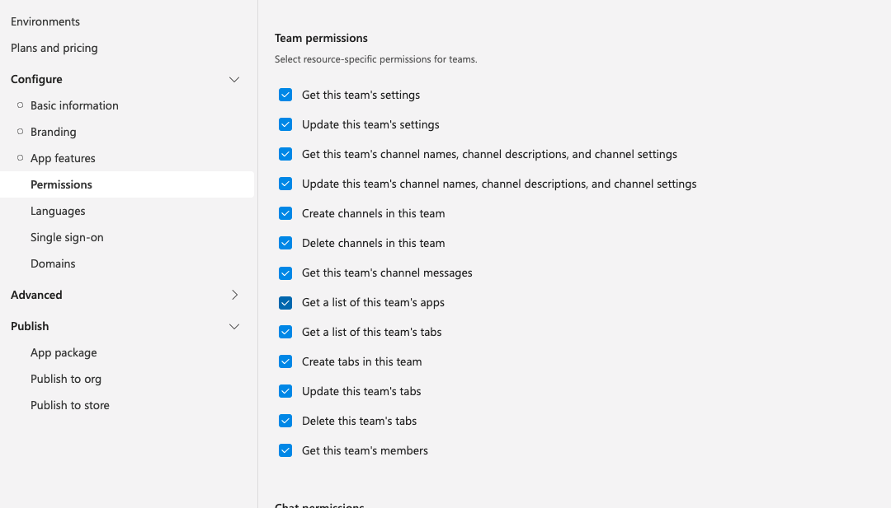

Note, we are going crazy here and giving _all_ the permissions.  You might well want to reduce the number available.  But, start with this as it might otherwise lead to problems later.

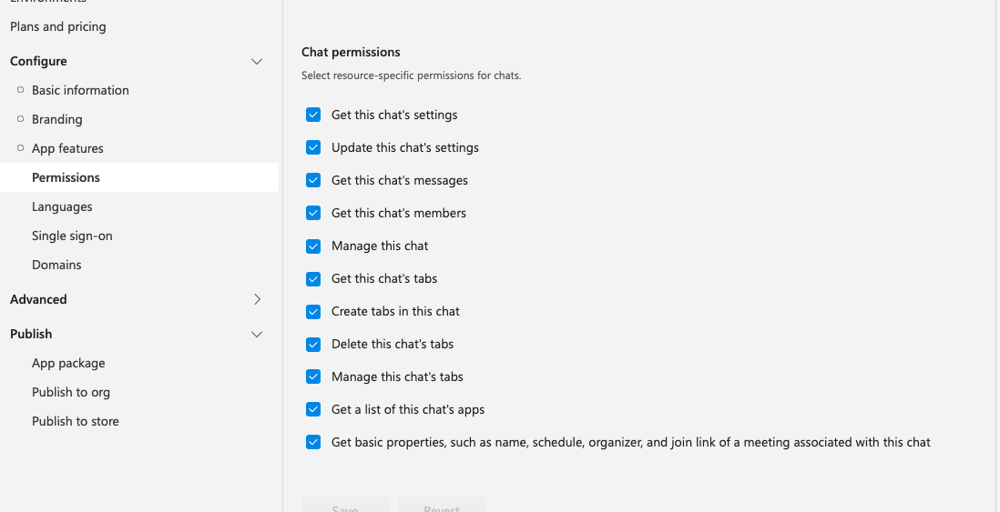

- Publish The App To Your Organisation

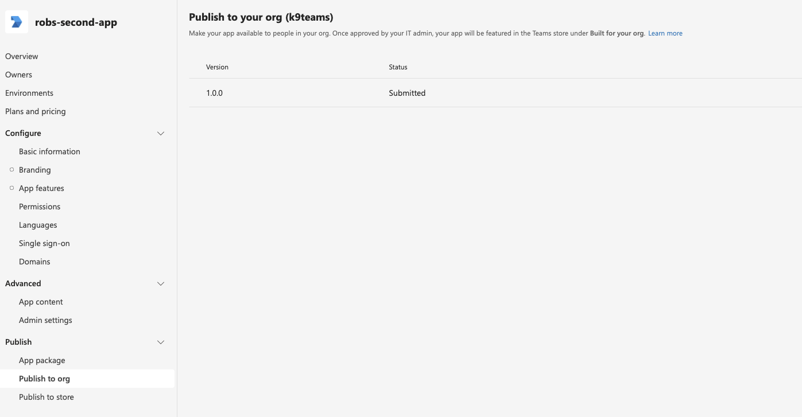

## Approve The App In The Teams Admin Console

Before you can see the App in the Teams App Store, it needs to be approved (published) by your Teams administrators.

The Admin Console has a "Manage Apps" section [here](https://admin.teams.microsoft.com/policies/manage-apps).

- Approve your new app by searching for it in the list  

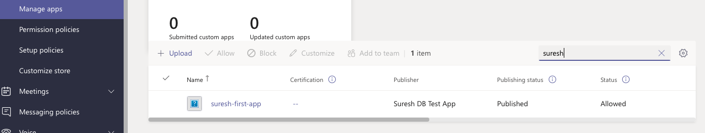

- Change Publishing Status to "Published"

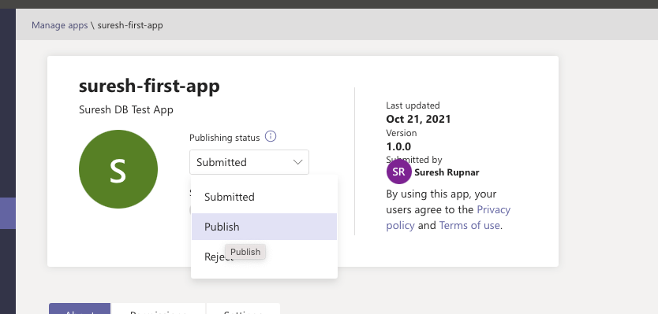

## Configuring The Bot

We're going to set up a bot running on the localhost, and then use [ngrok]() to port-forward the bot onto the internet, running in HTTPS with a proper certificate.  From there, we can get Microsoft Teams to talk to it.  

## A Simple Bot

- Set up the bot, TBC.

- Add AppId, Password to the config

- Start the bot:

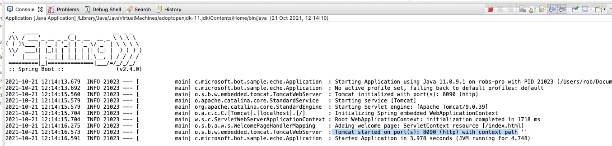

## NGrok port Forwarding

Since your bot is running on `localhost`, Microsoft Teams can't access it.  However, we can use `ngrok` to tunnel onto the public internet.  

- Install `ngrok` from [here](https://ngrok.com/)

- Start like this:

`ngrok http 8080`

- It will start a process like so:

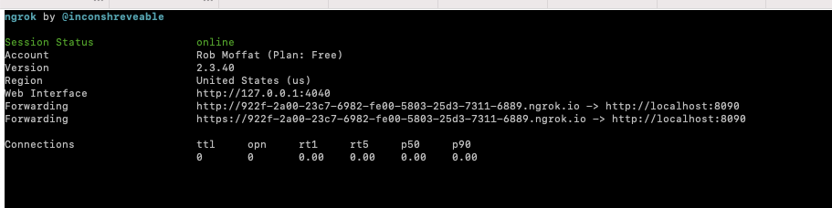

## Configure Teams Bot Endpoint

Now, we need to configure our Bot in Microsoft Teams to send messages to this endpoint.  For that, we go back into the Developer Portal, and find the Bot:

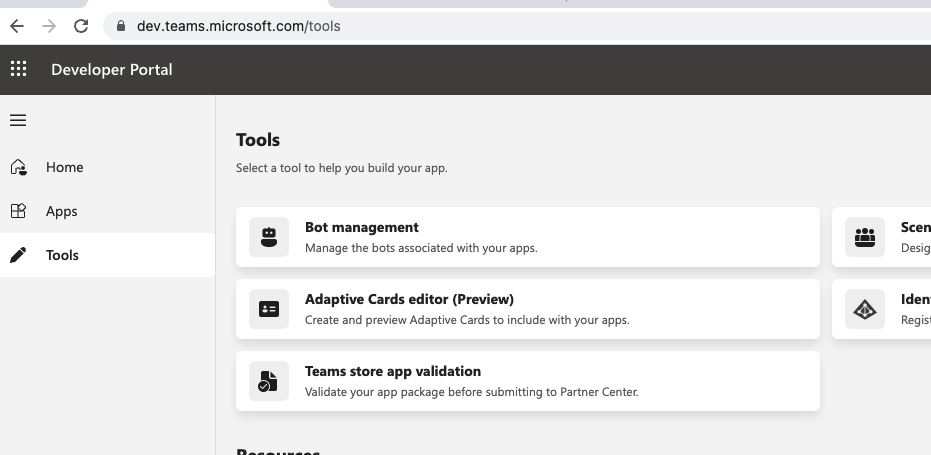

- Set the bot endpoint to use your `https` ngrok endpoint, with the path `/api/messages`.  

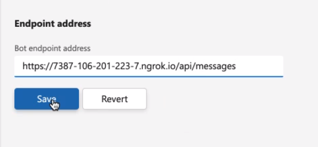

- At this point, you will probably need to restart teams, to clear the cache of the App Store.

- Go back to Teams and find the App in the App Store.  

- Add it to a team

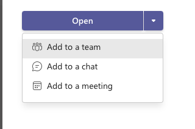

- Choose Your Team

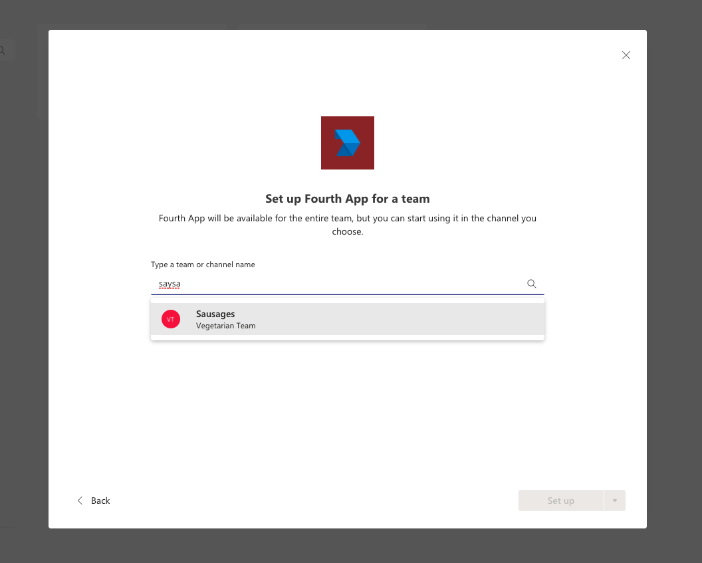

## Talk With Your Bot

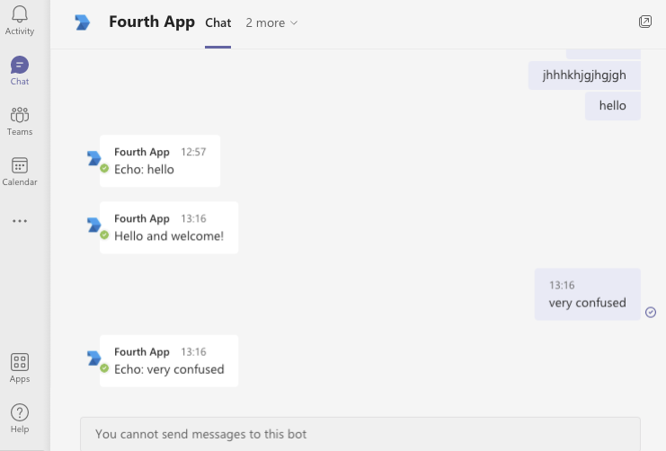

  

