# Building A Symphony App With Spring Boot

This tutorial will take you through the process of creating a new app
and running it inside the Symphony container.

An app looks something like this:

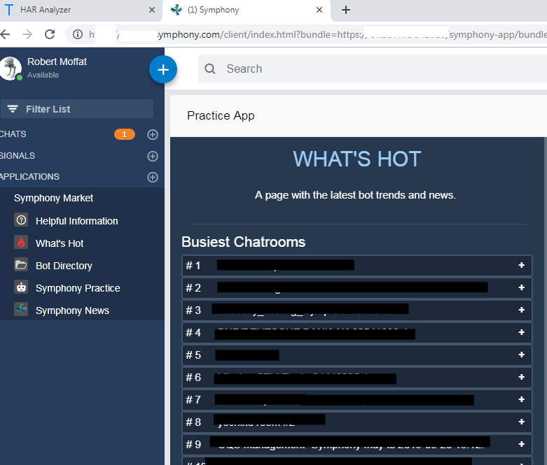

That is, it lives within the Symphony client, and occupies space inside
Symphony much like a chat would,

You can install apps from the **Symphony Market**, which is at the
bottom of the Left-Hand Navigator in the screenshot.

**NB:** You can cheat on this tutorial by looking at the finished code directly in [demo-app](demos/demo-app)

## What Can Apps Do?

There are lots of examples of apps [here](https://workflow.symphony.com/#/).  Basically, they are useful
for:

-   Providing extra functionality within the client
-   Adding buttons within chat windows
-   Adding rendering capabilities for custom message types.
-   Adding the ability to share different things within symphony
-   Performing actions On-Behalf-Of a user.

## Overview

Building an app from scratch can be quite hard.  There are several basic
components you need:

1.  **An application server** (in this guide, we\'ll use Spring Boot)
2.  **A Bundle Page** which describes your application to symphony, and
    gives a description for your app in the **Symphony market.**
3.  **A Controller Page** this is loaded up by the Symphony Client, and
    initializes your app.
4.  **Application Pages** to display to the user, like the "What's Hot" page above.

This diagram demonstrates how these different components interact:

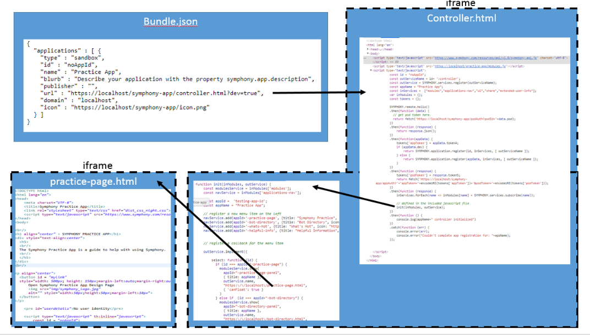

The [spring-boot-starter-symphony-app](../../spring-boot-starter-app) takes care of providing all this boilerplate for you.

## Security

Symphony takes security very seriously, and there is a complex security
model to allow your application to have access to the user's identity,
or perform On-Behalf-Of operations.  This involves completing
a **circle-of-trust** with the Symphony back-end, and is quite a
cumbersome process to code.  

Additionally, this process only works **once your application's
bundle.json file has been added to the Symphony Market on your pod.**

Here, we're going to develop the app first and then add this feature
afterwards.

Let's go!

## 1. Create a New Spring Boot Project

Let's head over to `https://start.spring.io` and create a new app
project:

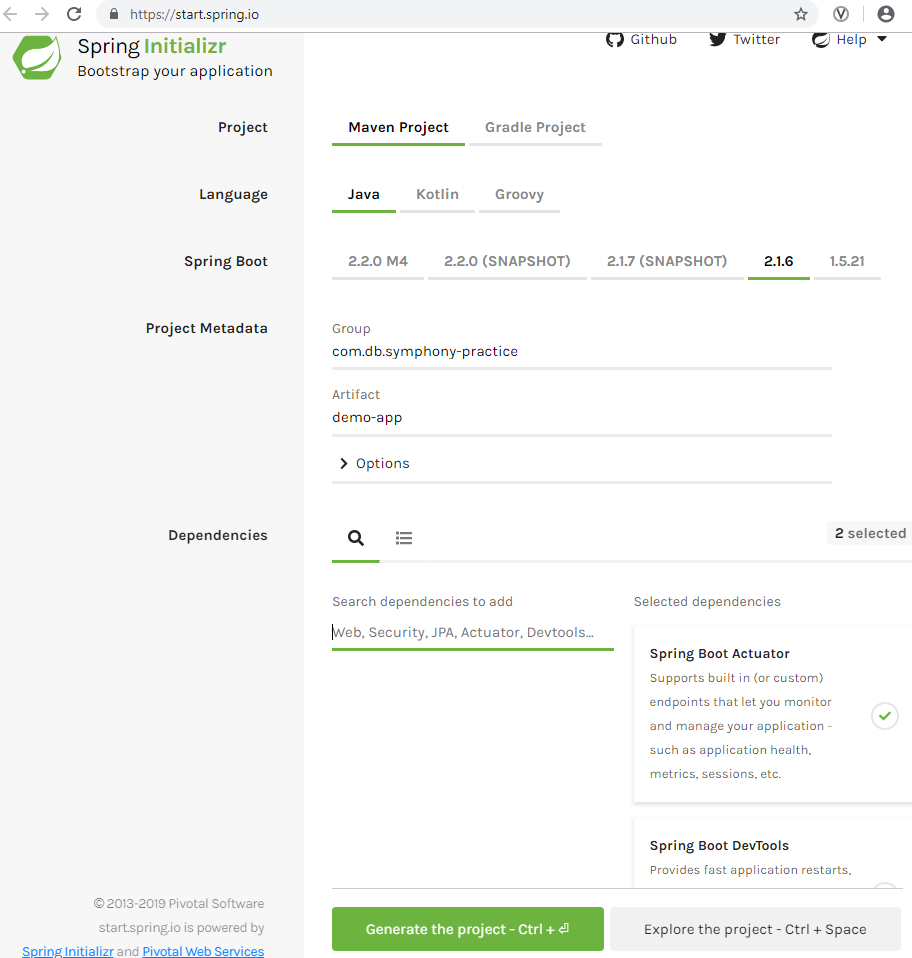

-   I've created a maven project, with actuator and devtools support
    built in.
-   When you click download, it will deliver a zip file which you can
    unpack in your file-system.

## 2. Import Into Your IDE

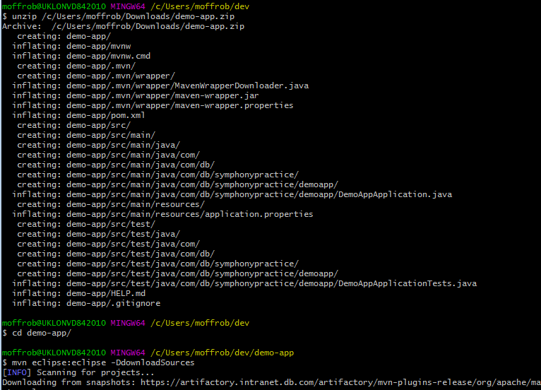

In this image, I'm downloading and unpacking Spring's zip file.  Next, I'm going to import the project
into Eclipse, but  If you are using a different IDE, substitute your step here.

Here is my project in eclipse:

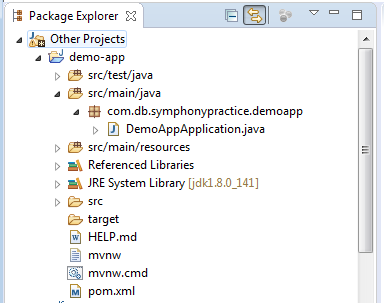

-   If I run the project now, I should see Spring start, and then finish
    (as we haven\'t actually added any code).

## 3. Add The Spring-Boot-Starter-Symphony-App Dependency

In `pom.xml` add this dependency:

```
<dependency>
   <groupId>org.finos.symphony.toolkit</groupId>
   <artifactId>symphony-app-spring-boot-starter</artifactId>
   <scope>compile</scope>
   <version>--latest version --</version>
</dependency>
```

Latest version: 


It looks like this for me: 

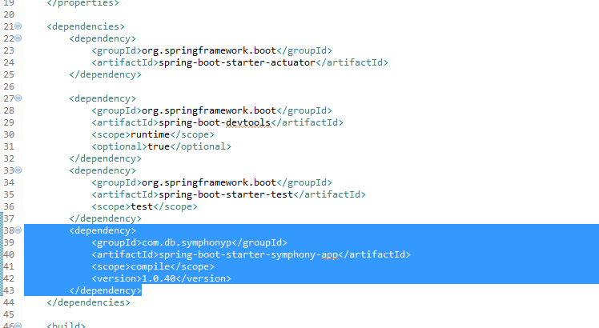

## 4. Add Jax-RS Dependency

JAX-RS provides the code to call REST endpoints.  You can either add Jersey, or CXF.  

Both are detailed on this page under Step 2: [Choose a JAX-RS Implementation.](../symphony-api-spring-boot-starter/README.md#Step-2-Choose-JAX-RS-Implementation)

#### CXF

Include this dependency:

```
<dependency>
   <groupId>org.apache.cxf</groupId>
   <artifactId>cxf-rt-rs-client</artifactId>
   <version>-- see project shields --</version>
   <scope>compile</scope>
</dependency>
```

#### Jersey

Include this:

```
<dependency>
  <groupId>org.glassfish.jersey.core</groupId>
  <artifactId>jersey-common</artifactId>
</dependency>

<dependency>
  <groupId>org.glassfish.jersey.core</groupId>
  <artifactId>jersey-client</artifactId>
</dependency>

<dependency>
  <groupId>org.glassfish.jersey.inject</groupId>
  <artifactId>jersey-hk2</artifactId>
</dependency>

<dependency>
  <groupId>org.glassfish.jersey.connectors</groupId>
  <artifactId>jersey-apache-connector</artifactId>
</dependency>

<dependency>
  <groupId>org.glassfish.jersey.media</groupId>
  <artifactId>jersey-media-multipart</artifactId>
</dependency>
```

You can use the Jersey BOM to avoid specifying version numbers like so:

```
<dependencyManagement>
  <dependencies>
    <dependency>
      <groupId>org.glassfish.jersey</groupId>
      <artifactId>jersey-bom</artifactId>
      <version>-- see project shields --</version>
      <type>pom</type>
      <scope>import</scope>
    </dependency>
  </dependencies>
</dependencyManagement>
```

## 5. Rebuild your Project

```
mvn eclipse:eclipse -DdownloadSources
```

-   Then, refresh in eclipse.

## 6.  Run The Application

At this point, you should be able to start the application using:

```
mvn spring-boot:run
```

And navigate to the bundle at [https://localhost/symphony-app/bundle.json](https://localhost/symphony-app/bundle.json:) 

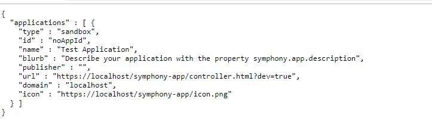

## 7.  Trust The Certificate

By default, the app comes with a self-signed certificate for localhost. 

-   Save the certificate by clicking the padlock in the url bar,
    certificate → details → Copy To File
    
-   If you leave the page open and ask Chrome to load it, it will load and be trusted within the browser session.

-   If you want to permanently trust it, you will need to add this to your trust store in Chrome.  Head to
    chrome://settings and add the certificate in to your \"Trusted Root
    Certification Authorities\" list

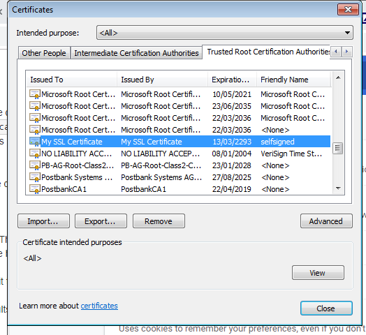

-   Restart Chrome.

## 8. Load Your App

-   You can load the app in Symphony now, by supplying the ?**bundle=extension** to the URL. e.g.

```
https://<your pod>.symphony.com/client/index.html?bundle=https://localhost/symphony-app/bundle.json
```
-   If Symphony loads the bundle ok, you will get this message:

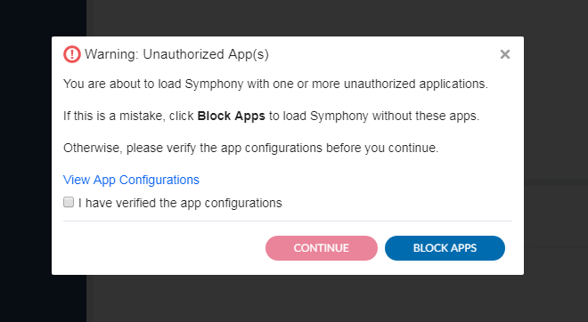

-   You should be able to click the check-box and hit continue.

-   Your app will now be available in the **Symphony Market.**  Navigate
    to that and install the app \"Test Application\ (Local)"

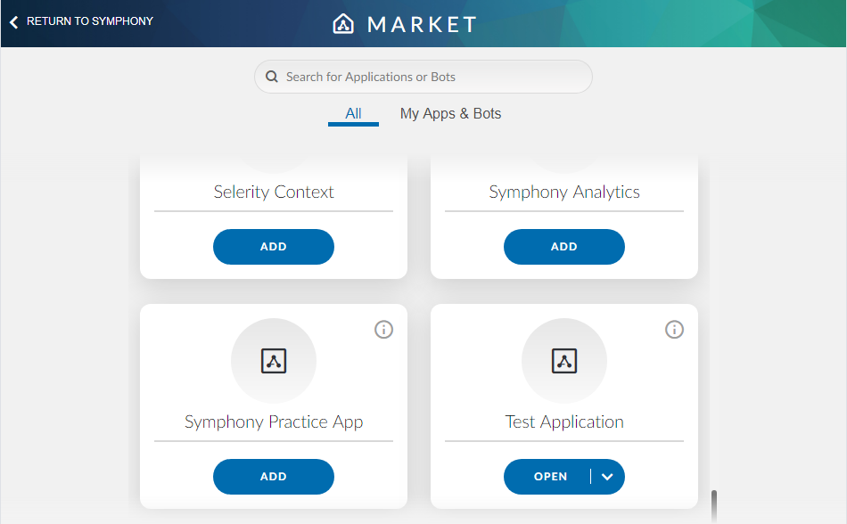

**NB:** Since taking this screenshot, apps loaded using **bundle=** have (Local) appended to their name.  This is to disambiguate versions of the app you might have running on another server.

## 9.  View The Sample Page

Finally, your app is visible in Symphony on the left-navigator:

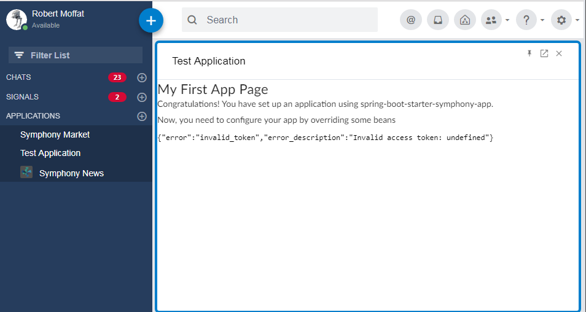

**NB:**, because the app is not installed in the pod, there is no
circle-of-trust and therefore the app doesn\'t have the user\'s
identity.  Hence the error message on this page.

Once we install in the pod, this test page will come back with the
user\'s details (see below)

## 10.  Adding Functionality

By default, the application calls a javascript
file `/symphony-app/starter-include.js` when it starts up.  This
provides the "Test Application" link on the left-hand navigator.

This is a Thymeleaf Template, and the source looks like this:

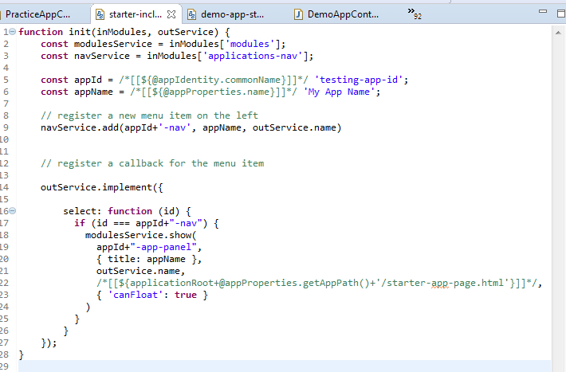

The code in /\* \*/ is actually part of Thymeleaf\'s Javascript
templating system.  It will replace these parameters when the javascript
is loaded.  

We're going to change the application in the following way:

1.  We'll load a different `starter-include` javascript file, which will add another element to the left-hand menu.
2.  We'll add a controller to return this javascript.
3.  We'll add a new static html page that the left-hand menu will open.

## 11. Customizing the Bundle

[The App Starter Readme](../symphony-app-spring-boot-starter/README.md) provides
details on how to customize the contents of the bundle file.  

You can set a description for the application, name, permissions, whether it is
allowed to use On-Behalf-Of the user, and URL used for the application.

(To determine the controller.html location, and hence where your app is
installed).  

We\'re going to make a couple of changes to the bundle now:

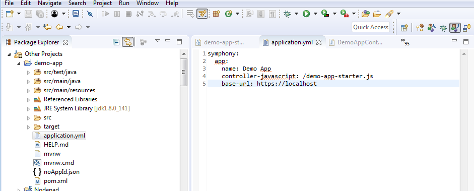

-   We're changing the name of the application to **Demo App.** This
    will be reflected in the Symphony Market.

-   Also, we've told it to load a different javascript `starter` file.

## 12.  Adding the New Javascript

-   Let's add the new controller javascript
    (**templates/demo-app-starter.js**), which adds code to add a second
    page to the left-hand navigator:

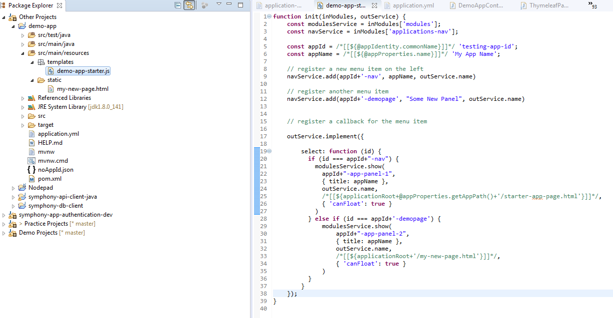

Here is the same code again so you can copy-paste:

```javascript
function init(inModules, outService) {
	const modulesService = inModules['modules'];
	const navService = inModules['applications-nav'];

	const appId = /*[[${@appIdentity.commonName}]]*/ 'testing-app-id';
	const appName = /*[[${@appProperties.name}]]*/ 'My App Name';
	
	// register a new menu item on the left
	navService.add(appId+'-nav', appName, outService.name)
	navService.add(appId+'-demopage', "Some New Panel", outService.name)

	// register a callback for the menu item

	outService.implement({
	        
	    select: function (id) {
	      if (id === appId+"-nav") {
	        modulesService.show(
	          appId+"-app-panel",
	          { title: appName },
	          outService.name,
	          /*[[${applicationRoot+@appProperties.getAppPath()+'/starter-app-page.html'}]]*/,
	          { 'canFloat': true }
	        )
	      } else if (id === appId+'-demopage') {
	          modulesService.show(
	              appId+"-app-panel-2",
	              { title: appName },
	              outService.name,
	              /*[[${applicationRoot+'/my-new-page.html'}]]*/,
	              { 'canFloat': true }
	            ) 
	          }
	    }
	});	
}

```

## 13. Serving The Javascript

-   In order to serve this javascript, we need to create a spring
    controller like so:

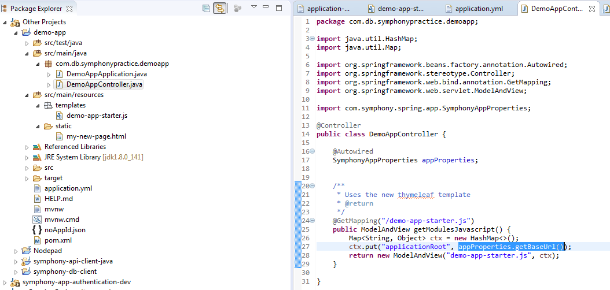

Here\'s the code for that:


```java
package example.symphony.demoapp;

import java.util.HashMap;
import java.util.Map;

import org.springframework.beans.factory.annotation.Autowired;
import org.springframework.stereotype.Controller;
import org.springframework.web.bind.annotation.GetMapping;
import org.springframework.web.servlet.ModelAndView;

import org.finos.symphony.toolkit.spring.app.SymphonyAppProperties;

@Controller
public class DemoAppController {

  @Autowired
  SymphonyAppProperties appProperties;

  /**
   * Uses the new thymeleaf template
   */
  @GetMapping("/demo-app-starter.js")
  public ModelAndView getModulesJavascript() {
    Map<String, Object> ctx = new HashMap<>();
    ctx.put("applicationRoot", appProperties.getBaseUrl());
    return new ModelAndView("demo-app-starter.js", ctx);
  }

}
```

## 14.  A HTML File To Load

-   Finally, we\'ll need some HTML to serve.  By placing it in
    **/src/main/resources/static,** spring will happily serve it as a
    regular, static html file without further modification.

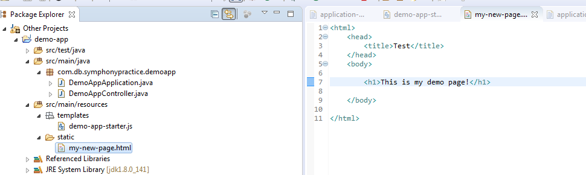

That looks like this:

```
<html>
 <head>
 <title>Test</title>
 </head>
 <body>
 
 <h1>This is my demo page!</h1>
 
 </body>
</html>
```

If all is well, your application should load up the new javascript, and
display **two **menu options:

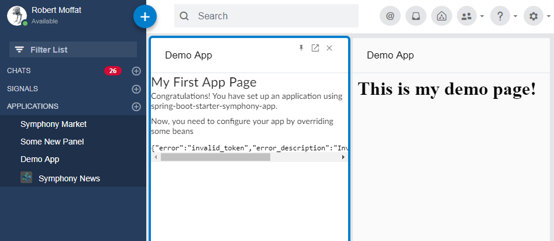

## 15.  Uploading the Bundle To The Pod

There are two bundle endpoints:

-   `/symphony-app/bundle.json`: This endpoint is used for testing
    with the **?bundle=url**

-   `/symphjony-app/<secret>/bundle.json`: This endpoint is used for
    uploading the bundle into the pod.  The structure is slightly
    different.

-   You can customize the secret by setting
    the `symphony.app.apiKey` property in `application.yml`.

-   In order to get your application installed permanently in the pod,
    the second bundle must be loaded into the Symphony admin console. 
    Provide the admin team with this bundle file to allow them to upload
    it.

You can tell your administrator whether to install the app for all
users, or just for a select few.

## 14. Completing the Circle Of Trust

Once your app is loaded into the pod, you can enable circle-of-trust by:

 - Setting `symphony.app.circleOfTrust=FULL` and adding one or more `symphony.api` entries.
 
If you are running in public, you'll probably want to enable pod registration (so that any pod loading your app will let you know how to talk to it).

This can be done by configuring a `PodInfoStore` bean.  You can enable the default (file-system based) store by configuring a location to store to with `symphony.app.store.location`
 
More on this in the [Readme](../symphony-app-spring-boot-starter/README.md)

  
